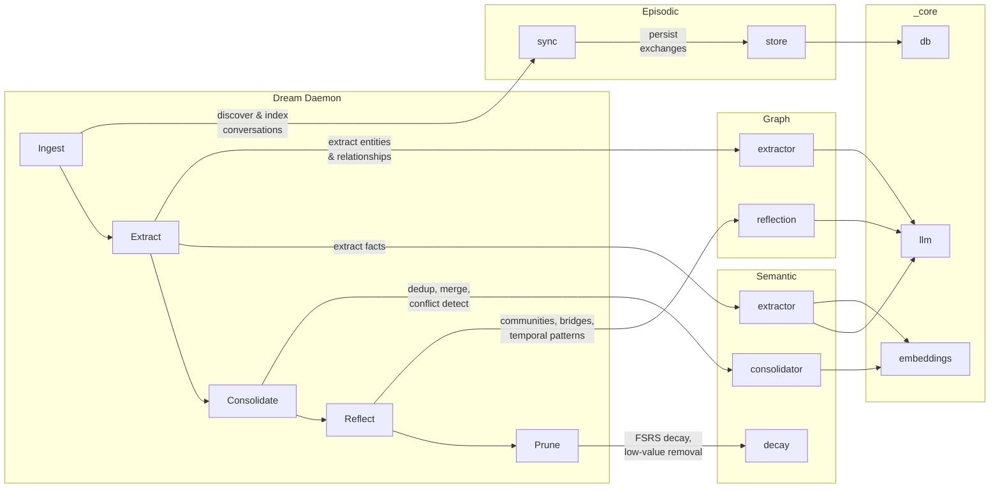

# Engram

[](https://github.com/devinmlowe/engram/actions/workflows/ci.yml)

> *An engram is the hypothetical physical trace of memory in neural tissue — the biochemical change that encodes what we've learned.*

<p align="center">
  
</p>

Local-first cognitive memory system that transforms raw LLM conversation history into structured, consolidated knowledge. Unlike traditional conversation search (which treats sessions as documents to retrieve), Engram mimics human memory architecture: **episodic memories are captured, consolidated into semantic knowledge during "dream state" processing, and emergent connections surface through graph analysis** — much like how a Zettelkasten's backlinks reveal Maps of Content that no individual note anticipated.

Designed as an MCP server for Claude Code and other LLM agents, with CLI and web visualization interfaces.

## Install & first run

**Prerequisites**

- Node.js 22 or newer (`node --version`)
- macOS, Linux, or Windows for the CLI, MCP server, and web visualizer. Scheduled
  background consolidation ships an installer for each (launchd, systemd user timer,
  Task Scheduler); see the platform matrix below.
- [Claude Code](https://docs.anthropic.com/en/docs/claude-code) if you want `engram sync` to ingest your conversation history from `~/.claude/projects`
- At least one LLM provider for extraction and dream consolidation (see [Configuration](#configuration)). Search, `remember`, and the web visualizer work without one.

```bash
git clone https://github.com/devinmlowe/engram.git
cd engram
npm install          # prints a platform preflight verdict, then builds via the "prepare" script
npm link             # puts `engram` on your PATH (or run `node dist/interfaces/cli/index.js` directly)

engram doctor        # node version, platform/arch, native modules, model cache, ollama tier — all [ok]?
engram init          # creates engram.db in the data dir (default ~/.local/share/engram; see Configuration) and downloads the embedding model
engram sync          # index conversations from ~/.claude/projects (optional)
engram search "what did I decide about caching"
```

> **Heads up: first run downloads models.** `engram init`, the first search, and the test
> suite pull `nomic-ai/nomic-embed-text-v1.5` (embeddings) and `Xenova/bge-reranker-base`
> (reranker) from Hugging Face — several hundred MB in total — into the model cache. By default
> that cache is `node_modules/@xenova/transformers/.cache/`, which every `npm install` / `npm ci`
> wipes; set `ENGRAM_MODEL_CACHE_DIR` to keep the models somewhere durable (see
> [Model cache](#model-cache)). Downloads happen once; later runs are offline.
> Set `ENGRAM_RERANK_ENABLED=false` to skip the reranker model.

**Use it from Claude Code (MCP)**

Add the server to your Claude Code MCP config (`~/.claude.json`, or a project-level `.mcp.json`),
pointing at the compiled server with an absolute path:

```json
{
  "mcpServers": {
    "engram": {
      "command": "node",
      "args": ["/absolute/path/to/engram/dist/interfaces/mcp/server.js"],
      "env": {}
    }
  }
}
```

The `.mcp.json` shipped in this repo does the same thing with a repo-relative path and is picked
up automatically when you open the engram checkout itself in Claude Code.

**Optional: background consolidation and visualization**

```bash
./scripts/install-daemon.sh install      # nightly `engram dream` at 02:00 via launchd
./scripts/install-visualizer.sh install  # macOS launchd visualizer
```

On Linux the same script detects `uname -s` and installs a systemd *user* timer instead
(no root; `loginctl enable-linger $USER` if you want it to fire while logged out):

```bash
./scripts/install-daemon.sh install      # renders systemd/engram-dream.{service,timer}, enables engram-dream.timer
./scripts/install-daemon.sh status       # systemctl --user list-timers + last log lines
./scripts/install-daemon.sh run-now      # systemctl --user start engram-dream.service
```

On Windows, use the built-in per-user Task Scheduler adapters:

```powershell
.\scripts\install-daemon.ps1 install -PersistEnv   # daily 02:00 task running the compiled CLI with the resolved node.exe
.\scripts\install-daemon.ps1 status
.\scripts\install-visualizer.ps1 install
.\scripts\install-visualizer.ps1 status
.\scripts\install-mcp-daemon.ps1 install           # per-user Task Scheduler task for the MCP HTTP daemon (loopback only)
.\scripts\install-mcp-daemon.ps1 status
```

**Windows: MCP HTTP daemon lifecycle**

`scripts/install-mcp-daemon.ps1` registers a per-user Task Scheduler task,
`\Engram\MCP`, that starts at logon and runs `scripts/run-mcp-daemon.ps1` with
absolute paths to `node.exe` and the compiled `dist\interfaces\mcp\server.js`.
The server binds `127.0.0.1:9907` by design — it has no authentication and
never binds any other address, so the task never exposes the MCP port to the
network.

Six verbs, same shape as the other installers: `install`, `uninstall`,
`start`, `stop`, `restart`, `status`. `status` reports both the Task
Scheduler state and a live `GET /health` check against the daemon.

Process hygiene: the runner writes its own pid and the child `node.exe` pid
to files under the data directory; `stop` and `uninstall` tree-kill those
pids with `taskkill.exe` and then sweep for any leftover `node.exe` or
`run-mcp-daemon.ps1` process by command line, so a stale or missing pid file
can never leave an orphan process behind.

Restart-on-failure is bounded at two levels: the runner gives up and exits 1
after 5 restarts within a 600-second window, and Task Scheduler itself
retries a failed task 3 times at 1-minute intervals before stopping — so a
broken install cannot restart-loop forever. A clean server exit (code 0) is
treated as a deliberate stop and is not restarted. The task inherits your
user-scope environment variables (API keys included); nothing is copied
into the task definition or committed to the repo.

**Reboot smoke-test procedure** (copy-paste each block in order):

1. Install and confirm it's healthy:
   ```powershell
   .\scripts\install-mcp-daemon.ps1 install
   .\scripts\install-mcp-daemon.ps1 status   # taskState Running, healthy True
   ```
2. Restart Windows and log back in — do not start anything by hand.
3. Confirm the task came back on its own:
   ```powershell
   .\scripts\install-mcp-daemon.ps1 status   # taskState Running, healthy True
   curl.exe http://127.0.0.1:9907/health     # { "status": "ok", ... }
   ```
4. Confirm the MCP handshake works — initialize, then the `initialized`
   notification, then `tools/list`, threading the `Mcp-Session-Id` response
   header through each call:
   ```powershell
   curl.exe -s -D headers.txt -o init.json http://127.0.0.1:9907/mcp `
     -H "Content-Type: application/json" `
     -H "Accept: application/json, text/event-stream" `
     -d '{"jsonrpc":"2.0","id":1,"method":"initialize","params":{"protocolVersion":"2025-03-26","capabilities":{},"clientInfo":{"name":"smoke-test","version":"1.0"}}}'
   $sid = (Select-String -Path headers.txt -Pattern '^Mcp-Session-Id:\s*(\S+)').Matches.Groups[1].Value

   curl.exe -s http://127.0.0.1:9907/mcp `
     -H "Content-Type: application/json" `
     -H "Accept: application/json, text/event-stream" `
     -H "Mcp-Session-Id: $sid" `
     -d '{"jsonrpc":"2.0","method":"notifications/initialized"}'

   curl.exe -s http://127.0.0.1:9907/mcp `
     -H "Content-Type: application/json" `
     -H "Accept: application/json, text/event-stream" `
     -H "Mcp-Session-Id: $sid" `
     -d '{"jsonrpc":"2.0","id":2,"method":"tools/list"}'
   ```
5. Confirm Codex/Claude Code can `recall` and `remember` through this same
   server without you starting Node by hand.
6. Stop it and confirm no MCP process survives:
   ```powershell
   .\scripts\install-mcp-daemon.ps1 stop
   Get-CimInstance Win32_Process -Filter "Name = 'node.exe'" | Where-Object CommandLine -like '*mcp\server.js*'   # empty
   ```
7. Uninstall and confirm only the visualizer task remains:
   ```powershell
   .\scripts\install-mcp-daemon.ps1 uninstall
   Get-ScheduledTask -TaskPath '\Engram\'   # lists Visualizer, not MCP
   ```

All visualizer paths run the same compiled Node server on loopback at `http://127.0.0.1:3001`
and write logs under the engram data directory; all dream paths run
`node dist/interfaces/cli/index.js dream` and log to `<data dir>/logs/dream.log`.

The installers render `launchd/*.plist` (macOS) or `systemd/engram-dream.service` (Linux)
from the checkout you run them in, whatever its
location, and use whichever `node` they find (fnm, Homebrew, nvm, or system). The dream daemon
takes its API keys from `~/.config/engram/env` (mode 600, created by the installer with a
commented template; `$XDG_CONFIG_HOME` is honoured) — the plist itself never contains secrets.
If you installed before that file existed, move the keys there and re-run `install`; see
[scripts/README.md](./scripts/README.md#service-environment-file-api-keys) for the steps.

Every script checks its external tools up front and names what to install. The visualizer
installer probes its port with `node` (or `curl` against `/api/health`), using `lsof` only as
an optional fast path when it is installed; the Claude Code post-compaction hook
(`scripts/compact-dream.sh`) and the Hermes heartbeat digest (`scripts/commitments-surface.sh`)
need only `node`; the hook honours `ENGRAM_DATA_DIR` / `ENGRAM_LOGS_DIR`. No script needs `jq`
or `python3`.

**Supported platforms**

| Component | macOS | Linux | Windows |
|---|---|---|---|
| CLI (`engram init/sync/search/dream`) | yes | yes | yes |
| MCP server (stdio + HTTP) | yes | yes | yes |
| Web visualizer (`node dist/interfaces/web/server.js`) | yes | yes | yes |
| Visualizer keep-alive service | launchd (`scripts/install-visualizer.sh`) | run under your own supervisor (systemd user unit, pm2) | Task Scheduler (`scripts/install-visualizer.ps1`) |
| Nightly dream daemon | launchd (`scripts/install-daemon.sh`) | systemd user timer `engram-dream.timer` (`scripts/install-daemon.sh`) | Task Scheduler (`scripts/install-daemon.ps1`) |
| MCP HTTP daemon keep-alive (`--http --port 9907`) | run under your own supervisor (launchd agent, KeepAlive) | run under your own supervisor (systemd user unit) | Task Scheduler (`scripts/install-mcp-daemon.ps1`) |
| Claude Code hooks (`scripts/*.sh`) | yes | yes (bash, node) | WSL or Git Bash only |

**Supported platform/arch set**

Engram depends on three native/prebuilt chains: `better-sqlite3`, `sqlite-vec` (alpha; ships
platform packages only), and `onnxruntime-node` (pulled in by `@xenova/transformers`). Engram
works where all three have prebuilt binaries:

| `process.platform`-`process.arch` | Machines | Status |
|---|---|---|
| `darwin-arm64` | Apple silicon Macs | supported (CI) |
| `darwin-x64` | Intel Macs | supported |
| `linux-x64` | x86-64 Linux (glibc) | supported (CI) |
| `linux-arm64` | 64-bit ARM Linux (glibc): Graviton, Raspberry Pi OS 64-bit, Apple-silicon VMs | supported |
| `win32-x64` | x86-64 Windows 10/11 | supported (CI, experimental) |
| `win32-arm64` | Windows on ARM (Snapdragon, Apple-silicon VMs running Windows 11 ARM) | **not supported** — see caveats |
| `linux-arm` | 32-bit ARM Linux (armv7: Raspberry Pi OS 32-bit, older SBCs) | **not supported** — see caveats |

Two things tell you where you stand: `npm install` runs a non-fatal **postinstall preflight**
(`scripts/preflight.cjs`) that prints `[ok]`/`[FAIL]` lines for node, platform/arch,
better-sqlite3 and sqlite-vec without ever failing the install (`ENGRAM_SKIP_PREFLIGHT=1` silences
it; `node scripts/preflight.cjs --strict` exits non-zero for CI), and `engram doctor` runs the full
post-build version of the same checks plus the model cache. `package.json` deliberately does not
declare hard `os`/`cpu` fields: those would refuse to install for anyone with a working toolchain
on an unlisted target.

**Caveats: Windows on ARM and armv7.** `sqlite-vec` publishes no binary for `win32-arm64` or
`linux-arm` (armv7), and the `onnxruntime-node` version pinned by `@xenova/transformers` 2.x has
no build for them either, so even a successful source build of `better-sqlite3` leaves
`engram init` failing on the sqlite-vec load. On Windows on ARM the practical workaround is to
install the **x64** Node.js build: Windows 11 runs it under emulation and the `win32-x64` prebuilts
load (slower, not covered by CI). On armv7 boards, use a 64-bit OS image (`linux-arm64`).

**Toolchain needed elsewhere.** On any target without prebuilts, `npm install` compiles
`better-sqlite3` from source with node-gyp, which needs a C++ toolchain and Python 3:

- Windows: Visual Studio 2022 **Build Tools** with the "Desktop development with C++" workload
  (MSVC compiler + Windows SDK) and Python 3. node-gyp finds them automatically; if it picks the
  wrong Visual Studio run `npm config set msvs_version 2022`.
- Linux: `gcc`/`g++`, `make`, and `python3` — Debian/Ubuntu `sudo apt install build-essential python3`;
  Fedora `sudo dnf install gcc-c++ make python3`; Alpine `apk add build-base python3` (musl builds are untested).
- macOS: Xcode Command Line Tools (`xcode-select --install`).

CI runs lint and the full test suite on all three OSes (x64 Linux/Windows, arm64 macOS).

## Core Principles

### Memory is Not Search

Engram is a **cognitive system** — it extracts meaning, consolidates patterns, detects contradictions, and surfaces emergent connections. Raw conversations are the input, not the output.

### Token Discipline

Memory injection must be surgical. Retrieved memories are capped within caller-specified token budgets, formatted for primacy placement, and delivered via progressive disclosure — pointers first, full content only on request.

### Emergent Discovery

Like a Zettelkasten, the value is in the connections. Opportunistic bidirectional linking, Maps of Content emerging from graph density, and the dream state daemon acting as the librarian who notices patterns across the collection.

### Local-First, Offline-Capable

All processing runs locally. No cloud dependencies except optional API calls for extraction/summarization (replaceable with local models via Ollama for true offline operation).

## Architecture

Four domains with shared core infrastructure:

- `episodic/` — Conversation archive ingestion, indexing, and episodic search
- `semantic/` — Knowledge extraction, consolidation, adaptive chunking, and semantic search
- `graph/` — Entity/relationship graph, topic clusters, file structure indexing, and graph traversal
- `dream/` — Autonomous consolidation pipeline (ingest → extract → consolidate → reflect → prune)
- `interfaces/` — CLI, MCP server, and web visualization
- `_core/` — Shared infrastructure (config, db, types, embeddings, search, llm, cache)
- `decisions/` — Architecture Decision Records

## MCP Server

15 tools for LLM agent memory operations:

| Tool | Purpose |
|------|---------|
| `recall` | Hybrid search (vector + FTS5 + graph) with token budget; reinforces returned memories (FSRS bookkeeping, `reinforce: false` opts out) and accepts per-call `scope` / `read_scopes` |
| `remember` | Store a single memory (fact, decision, pattern, etc.) |
| `show` | Retrieve full conversation or memory context |
| `explore` | Fixed-depth graph traversal from an entity |
| `reflect` | Graph analysis — communities, bridges, temporal patterns |
| `recall_session` | Stateful iterative search with session tracking and budget |
| `recall_drill` | Deep drill into a specific search result with budget deduction |
| `explore_selective` | Model-directed selective graph traversal with relevance filtering |
| `remember_batch` | Batch memory ingest with entity linking and adaptive chunking |
| `fetch_snippets` | Multi-range file snippet fetching (up to 20 ranges) |
| `index_file_structure` | Parse file structure into graph entities (multi-language) |
| `scan_file` | Regex-based file scanning with function context detection |
| `commitments` | List tracked commitments (promises, intentions, follow-ups owed by others) — overdue first |
| `commitments_update` | Mark a commitment done, dropped, or superseded |
| `ingest_turn` | Record one user/assistant turn of an external agent session (`session_id`, `turn_index`, `scope`, `user_text`, `assistant_text`) — idempotent upsert into the episodic layer; extracted memories inherit the scope |

### Transports: stdio (default) and HTTP

`dist/interfaces/mcp/server.js` speaks **stdio** by default, which is what the
`.mcp.json` example in "Install & first run" uses. Start it with `--http` to
serve **Streamable HTTP** instead:

```bash
node dist/interfaces/mcp/server.js --http            # http://127.0.0.1:9907/mcp
node dist/interfaces/mcp/server.js --http --port 9910
```

HTTP mode exposes `POST /mcp` (one MCP session per client, routed by the
`Mcp-Session-Id` header) plus `GET /health`, which returns JSON. It binds to
127.0.0.1 only. Point any Streamable-HTTP-capable client at it:

```json
{ "mcpServers": { "engram": { "type": "http", "url": "http://127.0.0.1:9907/mcp" } } }
```

In HTTP mode every tool call runs on a `node:worker_threads` pool, so a
multi-second `recall` never blocks `/health`, the handshake, or other clients.
Each worker owns its own SQLite connection and embedding model. Stdio mode
never spawns workers.

| Variable | Default | Purpose |
|----------|---------|---------|
| `ENGRAM_HTTP_WORKERS` | `2` | Worker count in HTTP mode (`0` = run tool calls inline on the main thread) |
| `ENGRAM_WORKER_TIMEOUT_MS` | `8000` | Per-call timeout; `remember`, `remember_batch`, `index_file_structure` and `reflect --refresh` use higher floors. A worker still silent at 2x the timeout is killed and respawned |

See the "MCP Server Transports" section of [CLAUDE.md](CLAUDE.md) for the
worker-pool internals (`worker-pool.ts`, `dispatch.ts`, `worker.ts`).

### Integrating other agents (Codex CLI, Cursor, custom hosts)

[docs/integrate-your-agent.md](docs/integrate-your-agent.md) is written to be
handed to an AI agent running in the host you want to connect. It states the
public contract (endpoints, handshake, tools, scoping) and the three behaviors
to implement (auto-recall before each turn, explicit MCP tools, capture via
`remember`), with a verify ladder and a worked Codex CLI example. The Hermes
Agent provider in `interfaces/hermes-plugin/` is the reference implementation.

## Updating an existing installation

Schema migrations run automatically on every database open (checkpointed in
`schema_migrations`, provably no-op on re-run), and your data lives outside
the repo (`~/.local/share/engram/engram.db`) — updating is a pull + rebuild +
service restart, never a re-install:

```bash
git fetch origin
git status --short        # resolve any local changes first
git pull origin main
npm ci                    # exact dependencies from package-lock.json; rebuilds via
                          # the "prepare" hook and runs the install preflight
npm run build             # only needed if you skipped npm ci
```

Schema migrations are additive and checkpointed; they run on the next database
open (any `engram` command), so there is no separate migration step. Read
[CHANGELOG.md](./CHANGELOG.md) for the release's upgrade notes — 0.2.0, for
example, re-extracts every conversation once on the first dream run (bound it
with `ENGRAM_DREAM_MAX_CONVERSATIONS`) and needs the Hermes plugin redeployed:

```bash
interfaces/hermes-plugin/deploy.sh                       # default profile
ENGRAM_PLUGIN_PROFILES="a b" interfaces/hermes-plugin/deploy.sh   # + named profiles
```

Then restart whatever supervises the running processes so they load the new
`dist/` output (and restart Hermes gateways so they load the redeployed plugin):

| Platform | MCP HTTP daemon | Dream daemon | Visualizer |
|---|---|---|---|
| macOS (launchd) | `launchctl kickstart -k gui/$(id -u)/ai.hermes.engram-mcp` | `launchctl kickstart -k gui/$(id -u)/com.engram.dreamstate` | see scripts/install-visualizer.sh |
| Windows (Task Scheduler) | `.\scripts\install-mcp-daemon.ps1 restart` | `.\scripts\install-daemon.ps1 restart` | `.\scripts\install-visualizer.ps1 restart` |
| Linux (systemd) | `systemctl --user restart engram-mcp` | `systemctl --user restart engram-dream` | see docs |

Verify after restarting:

```bash
engram health      # database, embedding model, MCP entry point
engram doctor      # node version, platform/arch, native modules, model cache, ollama tier
engram search "smoke test"   # end-to-end recall through the new build
```

`engram doctor` is the first stop if anything looks wrong after an update —
it reports node version, platform/arch, better-sqlite3 and sqlite-vec native
module state, and the local model cache.

## CLI

```
engram init            # Initialize database + download embedding model
engram sync            # Ingest conversations from Claude Code projects
engram search <query>  # Hybrid search across all memory layers
engram remember <text> # Store a memory
engram extract         # LLM-based fact extraction from a conversation
engram dream           # Run autonomous consolidation pipeline (--force re-extracts unchanged conversations)
engram reflect         # Show emergent graph patterns
engram explore <name>  # Explore entity connections
engram entities        # List/search entities
engram relationships   # Show relationships for an entity
engram stats           # Database statistics
engram health          # System health check (database, model, Ollama, MCP entry point)
engram doctor          # Runtime diagnostics: node, platform/arch, better-sqlite3, sqlite-vec, model cache, ollama tier (--json)
engram migrate --source <db>   # Import a legacy conversation-index SQLite DB (--source is required; no default path)
engram validate --source <db>  # Validate migration integrity against that source DB
engram backfill-event-ts  # Backfill event-time timestamps (temporal recall)
engram commitments [status]        # List tracked commitments (same XML as the MCP tool)
engram commitment-done <id>        # Mark a commitment done (--status dropped|superseded)
engram commitments-extract <conv>  # Re-scan one conversation (no checkpoint; proves dedupe)
engram export [--out f] [--scope s...] [--include-inactive] [--kinds ...]  # JSONL v1 of memories/entities/relationships/commitments (no embeddings)
engram import <file> [--scope override] [--dry-run]  # Idempotent by id (newer wins); vectors + FTS regenerated from content
engram mcp             # Start the MCP server (stdio; see Transports section)
```

## Web Visualization

Interactive knowledge graph visualization at `localhost:3001`:

| | |
|---|---|
| **Force Graph** (`/graph`) | **Depth View** (`/graph/depth`) |
| Obsidian-inspired 2D force-directed graph on Canvas. Nodes sized by mention count (sqrt scale), colored by entity type with degree-based brightness. Edges render with configurable center-dim gradients. Mention threshold slider, type filter pills, text search with neighbor highlighting, click-to-focus, and node dragging. | Three.js 3D graph where the vertical axis encodes relevance — a weighted blend of recency (30%), mention frequency (25%), bridge score (20%), creation age (10%), and degree (15%). Older and less-connected nodes sink to the bottom; active hubs rise to the top. Includes gravity passes that pull satellites toward their hubs and a growth animation that replays the graph's history from first node to present. |
|  |  |
| **Galaxy View** (`/graph/galaxy`) | **Word Cloud** (`/words`) |
| Hub nodes (high degree + bridge score + mentions) become gravitational centers, each defining a unique orbital plane in 3D space. Satellites orbit their hub based on accretion strength (edge weight), placed at angles determined by Jaccard similarity to neighbors. Six custom forces — hub repulsion, satellite attraction, disk flattening, orbital alignment, bridge pulling, and standard charge — create a living solar-system metaphor. Configurable hub threshold, disk flatness, and system spacing. | D3 word cloud built from user messages in episodic memory. Words sized by sqrt-scaled frequency, filtered through an extensive stop-word list and hex-hash detector. Catppuccin Mocha 12-color palette, Archimedean spiral packing with mixed rotation (65% horizontal, 20% vertical, 15% angled). Hover shows mention count; live polling refreshes every 10 seconds with pulse animations on changes. |
|  |  |

- **Dream Control** — Live pipeline phase tracking with progress bars via SSE
- **Real-time Updates** — SSE watching SQLite WAL for instant graph changes

Start: `npx tsx src/interfaces/web/server.ts`

For a persistent Windows installation, use [`scripts/install-visualizer.ps1`](scripts/install-visualizer.ps1). The macOS launchd path remains [`scripts/install-visualizer.sh`](scripts/install-visualizer.sh).

## Search

Hybrid search combining three sources with Reciprocal Rank Fusion:

- **Vector** — Semantic similarity via nomic-embed-text (384 dims) with MiniLM fallback
- **FTS5** — SQLite full-text search across exchanges, memories, and entities
- **Graph** — Entity traversal and relationship-aware context expansion

All search responses respect caller-specified token budgets. Stateful sessions allow iterative refinement with budget tracking.

## Dream Pipeline

Autonomous consolidation mimicking human memory synthesis:



1. **Ingest** — Sync new conversation archives via the **episodic** layer
2. **Extract** — LLM-based fact extraction (**semantic**) and entity/relationship extraction (**graph**)
3. **Consolidate** — Deduplicate, merge, and resolve conflicts via **semantic** consolidator with embedding similarity
4. **Reflect** — Detect communities, bridge entities, and temporal patterns via **graph** reflection
5. **Prune** — Decay and remove low-value memories using FSRS-inspired retrievability scoring (**semantic** decay)

All phases use **_core** infrastructure: `llm` for LLM calls, `db` for persistence, `embeddings` for similarity.

Run via `engram dream`, the web UI dream button, or nightly at 02:00 via `scripts/install-daemon.sh` (launchd on macOS, `engram-dream.timer` on Linux) / `scripts/install-daemon.ps1` (Windows Task Scheduler).

## Technology

| Component | Technology |
|-----------|------------|
| Runtime | Node.js ≥ 22 (TypeScript) |
| Database | SQLite + WAL mode (single-file, local-first) |
| Vector Search | sqlite-vec |
| Full-Text Search | SQLite FTS5 (Porter stemming) |
| Embeddings | nomic-embed-text via @xenova/transformers |
| Graph Analysis | graphology (Louvain communities, betweenness centrality) |
| LLM Providers | Anthropic, OpenRouter, Ollama (tiered cascade) |
| MCP Server | @modelcontextprotocol/sdk |
| Daemon | launchd (macOS), systemd user timer (Linux), Task Scheduler (Windows) — `scripts/install-daemon.sh` / `.ps1` |

## Development

```bash
npm run build        # TypeScript compilation
npm run test:run     # Run tests (vitest, 111 test files)
npm run mcp          # Start MCP server
npm run dev          # Dev CLI via tsx
npm run dream        # Run dream consolidation
npm run lint         # Type-check without emit
```

## Model cache

`@xenova/transformers` downloads ONNX model weights on first use (embeddings
`nomic-ai/nomic-embed-text-v1.5`, reranker `Xenova/bge-reranker-base`, and the NLI model used by
consolidation). Its default cache directory is **inside the package**,
`node_modules/@xenova/transformers/.cache/`, so every `npm install`, `npm ci`, or `rm -rf
node_modules` throws the models away and the next run re-downloads several hundred MB.

Set `ENGRAM_MODEL_CACHE_DIR` to relocate the cache; engram applies it to every model loader
(embeddings, reranker, NLI) before the first download:

```bash
export ENGRAM_MODEL_CACHE_DIR="$HOME/.local/share/engram/models"   # survives reinstalls
engram doctor                                                       # shows the effective location + writability
```

Any absolute path works (a shared network volume is fine; a read-only one works for already
downloaded models but new downloads fail). `engram doctor` prints the directory in use, whether it
is writable, and whether it came from `ENGRAM_MODEL_CACHE_DIR` or the library default. CI keeps
the default location and caches `node_modules/@xenova/transformers/.cache` between runs.

## Configuration

All settings are environment variables; the CLI and MCP server read nothing from a config file.
The one exception is the launchd dream daemon, whose launcher (`scripts/run-dream.sh`) sources
`~/.config/engram/env` so API keys stay out of the plist — any variable below can be set there.

| Variable | Default | Purpose |
|----------|---------|---------|
| `ANTHROPIC_API_KEY` | — | Enables the Anthropic provider (final tier of the LLM cascade) |
| `OPENROUTER_API_KEY` | — | Enables the OpenRouter provider (middle tier) |
| `OLLAMA_HOST` | `http://localhost:11434` | Ollama endpoint; used first if reachable |
| `ENGRAM_LOCAL_MODEL` | `qwen2.5:7b` | Ollama model name (must be pulled on the Ollama host) |
| `ENGRAM_LOCAL_MODEL_FALLBACKS` | — | Comma-separated Ollama models tried in order when `ENGRAM_LOCAL_MODEL` is not pulled (e.g. `llama3.1:8b,qwen3:8b`) |
| `ENGRAM_OPENROUTER_MODEL` | `google/gemini-2.5-flash-lite` | OpenRouter model name |
| `ENGRAM_DATA_DIR` | platform default (see below) | Root for database, archive, and logs |
| `ENGRAM_DB_PATH` | `$ENGRAM_DATA_DIR/engram.db` | SQLite database location |
| `ENGRAM_ARCHIVE_DIR` | `$ENGRAM_DATA_DIR/archive` | Conversation archive directory |
| `ENGRAM_LOGS_DIR` | `$ENGRAM_DATA_DIR/logs` | Log directory |
| `ENGRAM_CLAUDE_PROJECTS_DIR` | `~/.claude/projects` | Where `engram sync` looks for Claude Code conversations |
| `ENGRAM_EMBEDDING_DIMS` | `256` | Matryoshka embedding dimensions (must match the existing DB) |
| `ENGRAM_RERANK_ENABLED` | `true` | Set to `false` or `0` to disable the cross-encoder reranker |
| `ENGRAM_MODEL_CACHE_DIR` | `node_modules/@xenova/transformers/.cache/` | Where model weights are downloaded/cached (see [Model cache](#model-cache)) |
| `ENGRAM_SKIP_PREFLIGHT` | — | Set to `1` to silence the `npm install` platform preflight |
| `ENGRAM_CHUNKING_STRATEGY` | `fixed` | `fixed` or `adaptive` (content-aware boundaries) |
| `ENGRAM_BIND` | `127.0.0.1` | Web visualizer bind address (`0.0.0.0` to expose on the network) |
| `PORT` | `3001` | Web visualizer port |

**Data directory.** When `ENGRAM_DATA_DIR` is unset the default is `$XDG_DATA_HOME/engram` on
Linux/macOS and `%LOCALAPPDATA%\engram` on Windows; if that variable is unset or blank too, engram
falls back to `~/.local/share/engram` on every platform, so existing installs never move (on macOS,
where `XDG_DATA_HOME` is normally unset, the default stays `~/.local/share/engram`). Every component
(CLI, MCP server, dream daemon, web visualizer) resolves paths through this one rule.

**LLM providers.** Extraction and the dream pipeline try Ollama first (if `OLLAMA_HOST` answers
and `ENGRAM_LOCAL_MODEL` — or one of `ENGRAM_LOCAL_MODEL_FALLBACKS` — is pulled there; otherwise the
local tier is skipped with a one-time warning listing the models the host does have),
then OpenRouter (if `OPENROUTER_API_KEY` is set), then Anthropic (if `ANTHROPIC_API_KEY` is set).
`engram doctor` shows which local model, if any, the Ollama tier resolved to.
At least one must be configured for `engram extract` and `engram dream`; search, `remember`,
`remember_batch`, and the web visualizer do not need an LLM.

## References

- [SPEC.md](./SPEC.md) — Full system specification with requirements and interface contract
- [CHANGELOG.md](./CHANGELOG.md) — Release notes and upgrade steps per version
- [docs/history/SPEC-legacy.md](./docs/history/SPEC-legacy.md) — Original vision document with detailed design rationale (archived)
- [plans/](./plans/) — Implementation plans (phases 1–4, phase 6 RLM, phase 7 extensions)
- [decisions/](./decisions/) — Architecture Decision Records
