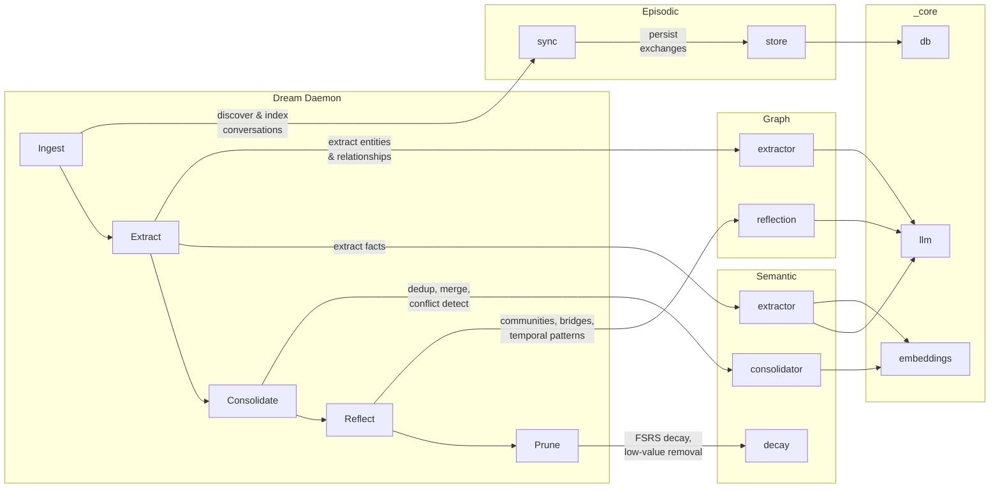

# Engram

[](https://github.com/devinmlowe/engram/actions/workflows/ci.yml)

> *An engram is the hypothetical physical trace of memory in neural tissue — the biochemical change that encodes what we've learned.*

<p align="center">
  
</p>

Local-first cognitive memory system that transforms raw LLM conversation history into structured, consolidated knowledge. Unlike traditional conversation search (which treats sessions as documents to retrieve), Engram mimics human memory architecture: **episodic memories are captured, consolidated into semantic knowledge during "dream state" processing, and emergent connections surface through graph analysis** — much like how a Zettelkasten's backlinks reveal Maps of Content that no individual note anticipated.

Designed as an MCP server for Claude Code and other LLM agents, with CLI and web visualization interfaces.

## Install & first run

**Prerequisites**

- Node.js 22 or newer (`node --version`)
- macOS, Linux, or Windows for the CLI, MCP server, and web visualizer. Scheduled
  background consolidation ships an installer for each (launchd, systemd user timer,
  Task Scheduler); see the platform matrix below.
- [Claude Code](https://docs.anthropic.com/en/docs/claude-code) if you want `engram sync` to ingest your conversation history from `~/.claude/projects`
- At least one LLM provider for extraction and dream consolidation (see [Configuration](#configuration)). Search, `remember`, and the web visualizer work without one.

**Quick start — three commands**

```bash
npx @devinmlowe/engram preflight    # is this node/platform/arch/libc covered by prebuilt native modules? (fix per OS if not)
npm install -g @devinmlowe/engram   # puts `engram` on your PATH; the postinstall hook runs the same preflight
engram setup                        # doctor → init → sync (asked) → register every host present → install the three services → doctor --fix → one real extraction → summary
```

`engram setup` walks a bare install to running and ends by telling you which LLM tier did
the extraction (`extraction smoke: tier=ollama memories=3`). Every step prints what it did and
the manual command it stands for, so nothing is hidden. It installs **all three services** —
the MCP HTTP daemon, the nightly dream timer and the web visualizer (port 3001, loopback) — by
default (decision #62); `--no-daemons` or `--daemons=mcp,dream` narrows that, `--host claude`
narrows host registration, `--no-sync` / `--sync` skip or force indexing, `--no-smoke` skips the
extraction, `--yes` answers every question for scripts (the Linux `loginctl enable-linger`
prompt is never implied), `--json` prints the result. With no LLM provider configured the
dream timer is still installed and setup ends with `[warn] dream timer installed but no LLM
tier is reachable …` naming the variables to set — exit 0; only a required doctor failure (or a
failed `init`) exits 1. Later, `engram doctor --fix` repairs whatever is red — the service env
file, a model cache inside `node_modules`, a missing Ollama model (asked first), a stopped MCP
daemon, an unregistered host — printing the manual equivalent of each; a second run says
`nothing to fix`. See [CLI](#cli) and `docs/api-reference.md`.

**The same, by hand**

```bash
engram mcp install claude           # registers engram with Claude Code (codex | cursor | hermes | --all); restart the host
```

`engram mcp install <host>` edits the host's own config for you — `~/.claude.json`
(`--project`: `.mcp.json`), `~/.codex/config.toml`, `~/.cursor/mcp.json`, or deploys the
Hermes plugin — atomically, with the previous content kept in `<file>.bak`, never touching
other servers, and re-running is a no-op. It prefers the HTTP daemon
(`http://127.0.0.1:9907/mcp`) when `GET /health` answers and falls back to stdio
(`node …/dist/interfaces/cli/index.js mcp`, which bridges to the daemon itself once one runs),
printing which and why; `--transport http|stdio` overrides, `--dry-run` shows the path and diff.
A daemon token is referenced as an environment variable (`${ENGRAM_MCP_TOKEN}` /
`bearer_token_env_var` / `${env:ENGRAM_MCP_TOKEN}`), never written; `engram mcp status` reports
every host, whether it points at this install, whether its daemon answers and whether the
variable resolves. See [Registering hosts](#registering-hosts-engram-mcp-install) below.

**From source**

```bash
git clone https://github.com/devinmlowe/engram.git
cd engram
node scripts/preflight.cjs   # optional: the native-dependency verdict before anything is installed
npm install          # runs the same preflight as postinstall, then builds via the "prepare" script
npm link             # puts `engram` on your PATH (or run `node dist/interfaces/cli/index.js` directly)
```

Either way, continue with `engram setup` — or step by step:

```bash
engram preflight     # prebuilt / compiled locally / unsupported per native module, with the fix for this OS
engram doctor        # node, platform/arch, native modules, model cache, ollama tier, llm providers, data dir, env file, install path, mcp daemon, hosts, extraction smoke — all [ok]?
engram doctor --fix  # apply the known remediations (env file, durable model cache, ollama pull with confirmation, start a stopped daemon, register a host) and re-check
engram init          # creates engram.db in the data dir (default ~/.local/share/engram; see Configuration) and downloads the embedding model
engram sync          # index conversations from ~/.claude/projects (optional)
engram search "what did I decide about caching"
engram mcp install --all   # from a checkout: register every host present (~/.claude, ~/.codex, ~/.cursor, ~/.hermes)
scripts/install-mcp-daemon.sh install; scripts/install-daemon.sh install; scripts/install-visualizer.sh install   # the three services (what setup runs)
```

`engram doctor` ends with an `extraction smoke` line: one real extraction over your most recent
conversation (or a bundled fixture when nothing is indexed yet) under a 60 s budget with a
capped input, reporting `tier=<ollama|openai|openrouter|anthropic> memories=N` or every tier's
reason when none answers. Memories it extracts from a real conversation are written like any
other, stamped `source=smoke` (find them with `engram memories list`, remove them with `forget`);
the fixture is never written. `--no-smoke` skips it; `--strict` exits 1 when any line is not
`[ok]` (CI).

> **First run downloads models once.** `engram init` (or the first search) pulls several hundred
> MB of model weights into `~/.local/share/engram/models` (or `$ENGRAM_MODEL_CACHE_DIR` /
> `$HF_HOME/hub`), where they survive reinstalls and upgrades; see [Model cache](#model-cache).
> Set `ENGRAM_RERANK_ENABLED=false` to skip the reranker model.

**Install as a Claude Code plugin (recommended)**

No clone, no absolute paths. In Claude Code:

```
/plugin marketplace add devinmlowe/engram
/plugin install engram@engram
```

This repo is its own marketplace (`.claude-plugin/marketplace.json`); the plugin
(`.claude-plugin/plugin.json`) runs the published npm package as a stdio MCP server —
`npx -y @devinmlowe/engram@<version> mcp`, version pinned to the release — and adds the
`/engram:recall`, `/engram:remember`, `/engram:explore-graph`, `/engram:reflect` and
`/engram:engram-connect` commands (bundled from `commands/`; their tools are
`mcp__plugin_engram_engram__<tool>`). `/mcp` should list `engram` with 16 tools; the first
`recall` downloads the embedding model once (see the note above). The plugin updates through
the marketplace (`/plugin update engram@engram` after a release); `engram update` keeps
handling the CLI, daemons and the Hermes plugin.

> **The very first start is slow.** The first `npx` run installs the package and its prebuilt
> native modules into the npm cache — once per pinned version, then it is a cache hit. If Claude
> Code reports the server timed out during that install, raise its startup timeout (milliseconds):
> `MCP_TIMEOUT=120000 claude`. Two warm paths: `npm install -g @devinmlowe/engram` first, so the
> package (and `engram doctor`/`engram init`) is already on the machine; or run the HTTP daemon
> (`scripts/install-mcp-daemon.sh install`, below) — `engram mcp` then bridges to it and the host
> process never opens the database or loads the model (see [Transports](#transports-stdio-default-and-http)).

**Registering hosts (`engram mcp install`)**

```bash
engram mcp install claude            # ~/.claude.json  (--project: ./.mcp.json)
engram mcp install codex             # ~/.codex/config.toml  (--project: ./.codex/config.toml)
engram mcp install cursor            # ~/.cursor/mcp.json  (--project: ./.cursor/mcp.json)
engram mcp install hermes            # deploys interfaces/hermes-plugin to ~/.hermes (+ profiles that already have it)
engram mcp install --all --dry-run   # every host whose config dir exists; print path + unified diff, write nothing
engram mcp status                    # registered? this install? daemon answering? ENGRAM_MCP_TOKEN resolving?
engram mcp uninstall codex           # removes only the engram entry; <file>.bak keeps the previous content
```

Decisions: HTTP when the daemon answers `/health`, else stdio (#51); the token is referenced by
environment variable and never written unless you pass `--inline-token` (#52). With the Claude
Code plugin installed, `mcp install claude` skips the user-scope entry (it would register the
server twice) unless `--force`; `mcp status` lists the plugin as a registered Claude host. A
GUI-launched host does not inherit a fish/zsh login shell, so when the daemon requires a token
`mcp status` prints the platform fix (`launchctl setenv ENGRAM_MCP_TOKEN …` on macOS,
`~/.config/environment.d/` on Linux, `setx` on Windows). No host process is restarted, and the
command needs no network beyond the loopback probe.

**Manual configuration (if you would rather edit the file yourself)**

Add the server to your Claude Code MCP config (`~/.claude.json`, or a project-level `.mcp.json`).
From npm:

```json
{
  "mcpServers": {
    "engram": { "command": "npx", "args": ["-y", "@devinmlowe/engram", "mcp"] }
  }
}
```

or, for a source checkout, point at the compiled server with an absolute path:

```json
{
  "mcpServers": {
    "engram": {
      "command": "node",
      "args": ["/absolute/path/to/engram/dist/interfaces/mcp/server.js"],
      "env": {}
    }
  }
}
```

The `.mcp.json` shipped in this repo does the same thing with a repo-relative path and is picked
up automatically when you open the engram checkout itself in Claude Code (it is for developing
engram; the plugin does not use it).

**Optional: background consolidation and visualization**

```bash
./scripts/install-mcp-daemon.sh install  # MCP HTTP daemon on 127.0.0.1:9907 via launchd (what the Hermes plugin talks to)
./scripts/install-daemon.sh install      # nightly `engram dream` at 02:00 via launchd
./scripts/install-visualizer.sh install  # macOS launchd visualizer
```

On Linux the same scripts detect `uname -s` and install systemd *user* units instead
(no root; `loginctl enable-linger $USER` if you want them to run while logged out):

```bash
./scripts/install-mcp-daemon.sh install  # renders systemd/engram-mcp.service, enables it (Restart=always)
./scripts/install-mcp-daemon.sh status   # unit state, GET /health, effective data dir, last log lines
./scripts/install-daemon.sh install      # renders systemd/engram-dream.{service,timer}, enables engram-dream.timer
./scripts/install-daemon.sh status       # systemctl --user list-timers + last log lines
./scripts/install-daemon.sh run-now      # systemctl --user start engram-dream.service
```

**macOS/Linux: MCP HTTP daemon lifecycle**

`scripts/install-mcp-daemon.sh` has the same six verbs as its Windows sibling
(`install`, `uninstall`, `start`, `stop`, `restart`, `status`). It renders
`launchd/com.engram.mcp.plist` (macOS) or `systemd/engram-mcp.service` (Linux)
from the checkout it runs in, builds `dist/`, and waits for `GET /health` before
reporting success. The service runs `scripts/run-mcp-daemon.sh`, which sources
`~/.config/engram/env` (created on `install`, mode 600) so `ENGRAM_DATA_DIR`,
`ENGRAM_MODEL_CACHE_DIR`, `ENGRAM_HTTP_WORKERS` and `ENGRAM_MCP_PORT` can change
without re-rendering anything. The data directory the installer resolved is
also rendered into the service, so the daemon and the CLI never open different
databases; `status` prints it and warns when a second `engram.db` exists at the
legacy path. `install` stops an unsupervised process holding the port and
retires a hand-written `ai.hermes.engram-mcp` LaunchAgent from the 0.1.x docs
(the file is renamed `*.retired-by-engram`, not deleted). `engram doctor`
reports the same `/health` probe as its `mcp daemon` check.

On Windows, use the built-in per-user Task Scheduler adapters:

```powershell
.\scripts\install-daemon.ps1 install -PersistEnv   # daily 02:00 task running the compiled CLI with the resolved node.exe
.\scripts\install-daemon.ps1 status
.\scripts\install-visualizer.ps1 install
.\scripts\install-visualizer.ps1 status
.\scripts\install-mcp-daemon.ps1 install           # per-user Task Scheduler task for the MCP HTTP daemon (loopback only)
.\scripts\install-mcp-daemon.ps1 status
```

**Windows: MCP HTTP daemon lifecycle**

`scripts/install-mcp-daemon.ps1` registers a per-user Task Scheduler task,
`\Engram\MCP`, that starts at logon and runs `scripts/run-mcp-daemon.ps1` with
absolute paths to `node.exe` and the compiled `dist\interfaces\mcp\server.js`.
The server binds `127.0.0.1:9907` by design — it has no authentication and
never binds any other address, so the task never exposes the MCP port to the
network.

Six verbs, same shape as the other installers: `install`, `uninstall`,
`start`, `stop`, `restart`, `status`. `status` reports both the Task
Scheduler state and a live `GET /health` check against the daemon.

Process hygiene: the runner writes its own pid and the child `node.exe` pid
to files under the data directory; `stop` and `uninstall` tree-kill those
pids with `taskkill.exe` and then sweep for any leftover `node.exe` or
`run-mcp-daemon.ps1` process by command line, so a stale or missing pid file
can never leave an orphan process behind.

Restart-on-failure is bounded at two levels: the runner gives up and exits 1
after 5 restarts within a 600-second window, and Task Scheduler itself
retries a failed task 3 times at 1-minute intervals before stopping — so a
broken install cannot restart-loop forever. A clean server exit (code 0) is
treated as a deliberate stop and is not restarted. The task inherits your
user-scope environment variables (API keys included); nothing is copied
into the task definition or committed to the repo.

**Reboot smoke-test procedure** (copy-paste each block in order):

1. Install and confirm it's healthy:
   ```powershell
   .\scripts\install-mcp-daemon.ps1 install
   .\scripts\install-mcp-daemon.ps1 status   # taskState Running, healthy True
   ```
2. Restart Windows and log back in — do not start anything by hand.
3. Confirm the task came back on its own:
   ```powershell
   .\scripts\install-mcp-daemon.ps1 status   # taskState Running, healthy True
   curl.exe http://127.0.0.1:9907/health     # { "status": "ok", ... }
   ```
4. Confirm the MCP handshake works — initialize, then the `initialized`
   notification, then `tools/list`, threading the `Mcp-Session-Id` response
   header through each call:
   ```powershell
   curl.exe -s -D headers.txt -o init.json http://127.0.0.1:9907/mcp `
     -H "Content-Type: application/json" `
     -H "Accept: application/json, text/event-stream" `
     -d '{"jsonrpc":"2.0","id":1,"method":"initialize","params":{"protocolVersion":"2025-03-26","capabilities":{},"clientInfo":{"name":"smoke-test","version":"1.0"}}}'
   $sid = (Select-String -Path headers.txt -Pattern '^Mcp-Session-Id:\s*(\S+)').Matches.Groups[1].Value

   curl.exe -s http://127.0.0.1:9907/mcp `
     -H "Content-Type: application/json" `
     -H "Accept: application/json, text/event-stream" `
     -H "Mcp-Session-Id: $sid" `
     -d '{"jsonrpc":"2.0","method":"notifications/initialized"}'

   curl.exe -s http://127.0.0.1:9907/mcp `
     -H "Content-Type: application/json" `
     -H "Accept: application/json, text/event-stream" `
     -H "Mcp-Session-Id: $sid" `
     -d '{"jsonrpc":"2.0","id":2,"method":"tools/list"}'
   ```
5. Confirm Codex/Claude Code can `recall` and `remember` through this same
   server without you starting Node by hand.
6. Stop it and confirm no MCP process survives:
   ```powershell
   .\scripts\install-mcp-daemon.ps1 stop
   Get-CimInstance Win32_Process -Filter "Name = 'node.exe'" | Where-Object CommandLine -like '*mcp\server.js*'   # empty
   ```
7. Uninstall and confirm only the visualizer task remains:
   ```powershell
   .\scripts\install-mcp-daemon.ps1 uninstall
   Get-ScheduledTask -TaskPath '\Engram\'   # lists Visualizer, not MCP
   ```

All visualizer paths run the same compiled Node server on loopback at `http://127.0.0.1:3001`
and write logs under the engram data directory; all dream paths run
`node dist/interfaces/cli/index.js dream` and log to `<data dir>/logs/dream.log`.

The installers render `launchd/*.plist` (macOS) or `systemd/engram-{mcp,dream}.service` (Linux)
from the checkout you run them in, whatever its
location, and use whichever `node` they find (fnm, Homebrew, nvm, or system). The dream daemon
takes its API keys from `~/.config/engram/env` (mode 600, created by the installer with a
commented template; `$XDG_CONFIG_HOME` is honoured) — the plist itself never contains secrets.
If you installed before that file existed, move the keys there and re-run `install`; see
[scripts/README.md](./scripts/README.md#service-environment-file-api-keys) for the steps.

Every script checks its external tools up front and names what to install. The visualizer
installer probes its port with `node` (or `curl` against `/api/health`), using `lsof` only as
an optional fast path when it is installed; the Claude Code post-compaction hook
(`scripts/compact-dream.sh`) and the Hermes heartbeat digest (`scripts/commitments-surface.sh`)
need only `node`; the hook honours `ENGRAM_DATA_DIR` / `ENGRAM_LOGS_DIR`. No script needs `jq`
or `python3`.

**Supported platforms**

| Component | macOS | Linux | Windows |
|---|---|---|---|
| CLI (`engram init/sync/search/dream`) | yes | yes | yes |
| MCP server (stdio + HTTP) | yes | yes | yes |
| Web visualizer (`node dist/interfaces/web/server.js`) | yes | yes | yes |
| Visualizer keep-alive service | launchd (`scripts/install-visualizer.sh`) | run under your own supervisor (systemd user unit, pm2) | Task Scheduler (`scripts/install-visualizer.ps1`) |
| Nightly dream daemon | launchd (`scripts/install-daemon.sh`) | systemd user timer `engram-dream.timer` (`scripts/install-daemon.sh`) | Task Scheduler (`scripts/install-daemon.ps1`) |
| MCP HTTP daemon keep-alive (`--http --port 9907`) | run under your own supervisor (launchd agent, KeepAlive) | run under your own supervisor (systemd user unit) | Task Scheduler (`scripts/install-mcp-daemon.ps1`) |
| Claude Code hooks (`scripts/*.sh`) | yes | yes (bash, node) | WSL or Git Bash only |

**Supported platform/arch set**

Engram depends on three native/prebuilt chains: `better-sqlite3`, `sqlite-vec` (alpha; ships
platform packages only), and `onnxruntime-node` (pulled in by `@xenova/transformers`). Engram
works where all three have prebuilt binaries for your `process.platform`, `process.arch` and libc
(glibc vs musl on Linux); since `better-sqlite3` 13 every chain is N-API, so the Node major no
longer matters as long as it is ≥ 22.
The table is generated from `scripts/preflight.cjs`, the same table the preflight and `engram
doctor` consult, and a test fails when the two drift:

<!-- supported-platforms:start -->
| Target | Machines | better-sqlite3 | sqlite-vec | onnxruntime-node | Engram |
|---|---|---|---|---|---|
| `darwin-arm64` | Apple silicon Macs | prebuilt | prebuilt | prebuilt | **supported** (CI: macos-latest) |
| `darwin-x64` | Intel Macs | prebuilt | prebuilt | prebuilt | **supported** |
| `linux-arm64` | 64-bit ARM Linux (glibc): Graviton, Raspberry Pi OS 64-bit, Apple-silicon VMs | prebuilt | prebuilt | prebuilt | **supported** (CI: ubuntu-24.04-arm) |
| `linux-x64` | x86-64 Linux (glibc: Debian, Ubuntu, Fedora, …) | prebuilt | prebuilt | prebuilt | **supported** (CI: ubuntu-latest) |
| `linuxmusl-arm64` | 64-bit ARM Alpine / musl | prebuilt | — | — | **not supported** |
| `linuxmusl-x64` | x86-64 Alpine / musl (`node:*-alpine` images) | prebuilt | — | — | **not supported** (CI: node:22-alpine container asserts this verdict) |
| `win32-arm64` | Windows on ARM (Snapdragon, Apple-silicon VMs running Windows 11 ARM) | prebuilt | — | prebuilt | **not supported** (CI: windows-11-arm asserts this verdict) |
| `win32-x64` | x86-64 Windows 10/11 | prebuilt | prebuilt | prebuilt | **supported** (CI: windows-latest, experimental) |
| any other target | FreeBSD, 32-bit x86, … | compiles | — | — | **not supported** |

Every native dependency (better-sqlite3, sqlite-vec, onnxruntime-node) is N-API / Node-version independent: the same binaries serve every Node major ≥ 22, odd (non-LTS) majors included. Generated from `scripts/preflight.cjs` by `node scripts/supported-platforms.cjs --write`; `--check` runs in the test suite.
<!-- supported-platforms:end -->

Three things tell you where you stand:

- `npx @devinmlowe/engram preflight` (or `engram preflight` once installed, `node
  scripts/preflight.cjs` in a checkout) prints one line per native module — `[ok] prebuilt`,
  `[warn] compiled locally` / `will compile (needs python3 + C++ toolchain)`, `[FAIL]
  unsupported`, `[--] unknown (<reason>)` — followed by the exact fix for your OS
  (`xcode-select --install`, `sudo apt install build-essential python3`, `sudo dnf install
  gcc-c++ make python3`, `apk add build-base python3`, Visual Studio Build Tools with the
  "Desktop development with C++" workload) and `nvm use <major>` when the gap is a Node major
  without prebuilds. After an install it inspects `node_modules` (a `build/Release` binary with
  no node-gyp artefacts is a prebuild; `config.gypi` / `Makefile` / `*.vcxproj` next to it mean
  it was compiled locally); before one, or offline, it answers from the static table. `--json`
  prints the structured result; `--strict` exits 1 on any `[FAIL]`; `--expect prebuilt` (or
  `--expect better-sqlite3=prebuilt,sqlite-vec=unsupported`) exits 1 unless the verdicts match,
  which is how CI fails a dependency bump that drops a prebuild. `npm_config_platform` /
  `npm_config_arch` / `npm_config_target_arch` / `npm_config_libc` override the target.
- `npm install` runs that preflight as a non-fatal **postinstall hook** (`ENGRAM_SKIP_PREFLIGHT=1`
  silences it). It never fails the install: `package.json` deliberately declares no hard
  `os`/`cpu` fields, which would refuse to install for anyone with a working toolchain on an
  unlisted target.
- `engram doctor` runs the full post-build checks; its `better-sqlite3` and `sqlite-vec` lines
  end with `prebuilt — …` or `compiled locally — …`, which tells an upgrade that silently fell
  back to node-gyp apart from one that used the prebuild (a bump that drops a prebuild for your
  Node major is the usual cause: `nvm use 24` or install the toolchain).

**Caveats: Windows on ARM, armv7 and Alpine/musl.** `sqlite-vec` publishes no binary for
`win32-arm64` or `linux-arm` (armv7), and its Linux builds — like `onnxruntime-node`'s — are
glibc-only (they need `ld-linux` and do not load on musl even with `gcompat`). `better-sqlite3`
itself ships prebuilds for `win32-arm64` and musl (13.x dropped its 32-bit `linux-arm` ones, so
armv7 compiles it from source), so `npm install` *succeeds* there and `engram init` then fails on
the sqlite-vec load; the preflight reports `[FAIL] sqlite-vec: unsupported` up front. On Windows
on ARM the practical workaround is to install the **x64** Node.js build: Windows 11 runs it under
emulation and the `win32-x64` prebuilts load (slower, not covered by CI). On armv7 boards, use a
64-bit OS image (`linux-arm64`). On Alpine, use a glibc image (`node:22-bookworm-slim`).

**npm 10 still runs node-gyp for `better-sqlite3` 13.** The package bundles its binaries, but the
lockfile does not carry its `gypfile: false`, so npm 10 (Node 22's bundled npm) runs the implicit
`node-gyp rebuild` at install anyway. `binding.gyp` compiles nothing when a bundled prebuild
matches, yet `node-gyp configure` still needs Python 3 and the Node headers — downloaded from
nodejs.org once per Node version (cached under `~/.cache/node-gyp`), so an offline or proxied
install can fail on a prebuilt target. **On Windows this makes Node 22 installs need a
node-gyp-recognised Visual Studio (2019/2022 Build Tools with the C++ workload) plus Python 3**,
because `node-gyp configure` fails with `could not find a version of Visual Studio 2017 or newer`
before it ever reads binding.gyp — CI's `windows-latest, node 22` job shows exactly that. npm 11
(Node 24, or `npm install -g npm@11` on Node 22) skips the script instead, so that is the simplest
workaround. The preflight reports `[ok] better-sqlite3: prebuilt — prebuilds/<target>.node is
bundled in the package` either way.

**Toolchain needed elsewhere.** On a target `better-sqlite3` bundles no prebuild for (a platform
not in the table, such as armv7 or FreeBSD), `npm install` compiles it from source with node-gyp,
which needs a C++ toolchain and Python 3:

- Windows: Visual Studio 2022 **Build Tools** with the "Desktop development with C++" workload
  (MSVC compiler + Windows SDK) and Python 3. node-gyp finds them automatically; if it picks the
  wrong Visual Studio run `npm config set msvs_version 2022`.
- Linux: `gcc`/`g++`, `make`, and `python3` — Debian/Ubuntu `sudo apt install build-essential python3`;
  Fedora `sudo dnf install gcc-c++ make python3`; Alpine `apk add build-base python3`.
- macOS: Xcode Command Line Tools (`xcode-select --install`).

CI runs lint and the full test suite on Node 22 and 24 for x64 Linux, arm64 Linux
(`ubuntu-24.04-arm`), arm64 macOS and x64 Windows (experimental), runs `preflight --strict
--expect prebuilt` on each so a dependency bump that drops a prebuild fails there and not on a
user's machine, and asserts the documented *unsupported* verdict on `windows-11-arm` and in a
`node:22-alpine` (musl) container. Dependabot groups bumps of the native modules separately and
they are labelled `native-dep` for manual prebuild review.

## Core Principles

### Memory is Not Search

Engram is a **cognitive system** — it extracts meaning, consolidates patterns, detects contradictions, and surfaces emergent connections. Raw conversations are the input, not the output.

### Token Discipline

Memory injection must be surgical. Retrieved memories are capped within caller-specified token budgets, formatted for primacy placement, and delivered via progressive disclosure — pointers first, full content only on request.

### Emergent Discovery

Like a Zettelkasten, the value is in the connections. Opportunistic bidirectional linking, Maps of Content emerging from graph density, and the dream state daemon acting as the librarian who notices patterns across the collection.

### Local-First, Offline-Capable

All processing runs locally. No cloud dependencies except optional API calls for extraction/summarization (replaceable with local models via Ollama for true offline operation).

## Architecture

Four domains with shared core infrastructure:

- `episodic/` — Conversation archive ingestion, indexing, and episodic search
- `semantic/` — Knowledge extraction, consolidation, adaptive chunking, and semantic search
- `graph/` — Entity/relationship graph, topic clusters, file structure indexing, and graph traversal
- `dream/` — Autonomous consolidation pipeline (ingest → extract → consolidate → reflect → prune)
- `interfaces/` — CLI, MCP server, and web visualization
- `_core/` — Shared infrastructure (config, db, types, embeddings, search, llm, cache)
- `decisions/` — Architecture Decision Records

## MCP Server

16 tools for LLM agent memory operations:

| Tool | Purpose |
|------|---------|
| `recall` | Hybrid search (vector + FTS5 + graph) with token budget; reinforces returned memories (FSRS bookkeeping, `reinforce: false` opts out) and accepts per-call `scope` / `read_scopes` |
| `remember` | Store a single memory (fact, decision, pattern, etc.) |
| `show` | Retrieve full conversation or memory context |
| `explore` | Fixed-depth graph traversal from an entity; honours per-call `scope` / `read_scopes` (#25) |
| `reflect` | Graph analysis — communities, bridges, temporal patterns |
| `recall_session` | Stateful iterative search with session tracking and budget |
| `recall_drill` | Deep drill into a specific search result with budget deduction |
| `explore_selective` | Model-directed selective graph traversal with relevance filtering; honours `read_scopes` |
| `remember_batch` | Batch memory ingest with entity linking and adaptive chunking |
| `fetch_snippets` | Multi-range file snippet fetching (up to 20 ranges) |
| `index_file_structure` | Parse file structure into graph entities (multi-language) |
| `scan_file` | Regex-based file scanning with function context detection |
| `commitments` | List tracked commitments (promises, intentions, follow-ups owed by others) — overdue first; honours `read_scopes` |
| `commitments_update` | Mark a commitment done, dropped, or superseded |
| `ingest_turn` | Record one user/assistant turn of an external agent session (`session_id`, `turn_index`, `scope`, `user_text`, `assistant_text`) — idempotent upsert into the episodic layer; extracted memories inherit the scope |
| `forget` | Remove a memory the user says is wrong or stale (#55): `memory_id` (the `id` on every recalled `<semantic>`) acts in one call; `query` returns candidates with ids and only acts with `confirm: true` and a single unambiguous match. Soft delete kept for `ENGRAM_FORGET_RETENTION_DAYS` (vector/FTS rows removed at once, change-logged with the client's name, not re-extracted by dream); `hard: true` deletes outright; honours `read_scopes` unless `scope: "global"` |

### Transports: stdio (default) and HTTP

`dist/interfaces/mcp/server.js` (and `engram mcp`, what the plugin runs) speaks
**stdio** by default, which is what the `.mcp.json` example in "Install & first
run" uses. Start it with `--http` to serve **Streamable HTTP** instead:

```bash
node dist/interfaces/mcp/server.js --http            # http://127.0.0.1:9907/mcp
node dist/interfaces/mcp/server.js --http --port 9910
```

HTTP mode exposes `POST /mcp` (one MCP session per client, routed by the
`Mcp-Session-Id` header) plus `GET /health`, which returns JSON. It binds to
127.0.0.1 only. Point any Streamable-HTTP-capable client at it:

```json
{ "mcpServers": { "engram": { "type": "http", "url": "http://127.0.0.1:9907/mcp" } } }
```

(`engram mcp install <host>` writes exactly this when the daemon answers `/health`, plus the
token header reference when one is configured.)

In HTTP mode every tool call runs on a `node:worker_threads` pool, so a
multi-second `recall` never blocks `/health`, the handshake, or other clients.
Each worker owns its own SQLite connection and embedding model. Stdio mode
never spawns workers.

**Stdio bridges to a running daemon.** A stdio start (`engram mcp`, the plugin's
`npx` command, `node dist/interfaces/mcp/server.js`) first probes
`GET http://127.0.0.1:<port>/health` (`--port`, else `ENGRAM_MCP_PORT`, else 9907,
1.5 s timeout). If the engram daemon answers, the process runs as a thin proxy —
an MCP client to the daemon's `/mcp` plus an MCP server on stdio forwarding
`tools/list`, `tools/call` and `ping` — and never opens the database or loads
the embedding model; every host then shares one warm daemon. Otherwise it runs
the full server in-process as before. One stderr line says which:

```
Engram MCP: bridging stdio to http://127.0.0.1:9907/mcp (daemon healthy)
Engram MCP: running inline (no daemon on :9907 (ECONNREFUSED))
```

`engram mcp --standalone` (or `ENGRAM_MCP_STANDALONE=1` in the server's env)
forces inline. The bridge forwards `Authorization: Bearer $ENGRAM_MCP_TOKEN`
from its own environment when the daemon requires a token, re-opens its daemon
session under the host's `clientInfo` (so `forget` still records the real
actor) and survives a daemon restart (`engram update`) with one reconnect.

| Variable | Default | Purpose |
|----------|---------|---------|
| `ENGRAM_HTTP_WORKERS` | `2` | Worker count in HTTP mode (`0` = run tool calls inline on the main thread) |
| `ENGRAM_WORKER_TIMEOUT_MS` | `8000` | Per-call timeout; `remember`, `remember_batch`, `index_file_structure` and `reflect --refresh` use higher floors. A worker still silent at 2x the timeout is killed and respawned |
| `ENGRAM_MCP_TOKEN` | — | When set, `/mcp` requires `Authorization: Bearer <token>` (401 otherwise); `/health` stays open for supervisors. Required before the daemon will bind anything but loopback |
| `ENGRAM_MCP_HOST` | `127.0.0.1` | Bind address. Anything but loopback is refused unless `ENGRAM_MCP_TOKEN` is set |
| `ENGRAM_MCP_STANDALONE` | — | `1` makes a stdio start run inline even when the daemon is healthy (same as `--standalone`) |

**Authentication.** Both HTTP servers rely on the loopback bind for access control by default:
anyone who can reach `127.0.0.1` (other local users, a reverse proxy) has full read/write access
to the memory store. Set `ENGRAM_MCP_TOKEN` (in `~/.config/engram/env` for the supervised daemon)
to require a bearer token; Streamable-HTTP clients send it as a header, e.g.
`{ "type": "http", "url": "http://127.0.0.1:9907/mcp", "headers": { "Authorization": "Bearer <token>" } }`,
and the Hermes plugin reads it from `token` in `engram.json`. `engram mcp install` never writes
the literal: it references the variable (`Bearer ${ENGRAM_MCP_TOKEN}` for Claude Code,
`bearer_token_env_var` for Codex, `Bearer ${env:ENGRAM_MCP_TOKEN}` for Cursor) so the secret
stays in `~/.config/engram/env` — `engram mcp status` tells you when the host's environment does
not resolve it. The token is compared in constant time and never logged. The visualizer uses `ENGRAM_WEB_TOKEN` (falling back to `ENGRAM_MCP_TOKEN`);
see [Web Visualization](#web-visualization).

See the "MCP Server Transports" section of [CLAUDE.md](CLAUDE.md) for the
worker-pool internals (`worker-pool.ts`, `dispatch.ts`, `worker.ts`).

### Integrating other agents (Codex CLI, Cursor, custom hosts)

`engram mcp install codex` / `cursor` registers the MCP tools (see
[Registering hosts](#registering-hosts-engram-mcp-install)); `engram mcp install codex &&
engram mcp install cursor` gives both hosts one `engram.db`, so a `remember` from Codex is
`recall`-able from Cursor. For auto-recall hooks and instruction blocks,
[docs/integrate-your-agent.md](docs/integrate-your-agent.md) is written to be
handed to an AI agent running in the host you want to connect. It states the
public contract (endpoints, handshake, tools, scoping) and the three behaviors
to implement (auto-recall before each turn, explicit MCP tools, capture via
`remember`), with a verify ladder and a worked Codex CLI example. The Hermes
Agent provider in `interfaces/hermes-plugin/` is the reference implementation.

## Updating an existing installation

Your data lives outside the repo (`engram doctor` prints the effective data
dir and database), schema migrations are additive and run on every database
open, and `engram update` does the rest — one command per platform:

```bash
engram update --check   # current vs available (git tag or npm dist-tag), nothing else; cached 24 h
engram update --plan    # read-only: install kind, every dir holding an engram.db, model cache,
                        # every service and how it will be restarted, plugin deploy targets
engram update           # the controlled upgrade (asks once; --yes for scripts, --no-backup to skip the backup)
engram update --rollback            # undo the last update: previous code back, services restarted, verified
engram update --rollback --restore-data   # …and put the pre-update backup of the data dir back
```

```powershell
engram update --plan    # identical on Windows (Task Scheduler tasks under \Engram\)
engram update --yes
```

What a run does, in order (the `--plan` output is this list with your machine's
paths filled in):

1. **Backup** the data dir (`engram.db` + `-wal`/`-shm` + `archive/`) to a
   sibling `<data dir>.backup-<timestamp>` after checkpointing the WAL.
2. **Stop** every running engram service through its supervisor: dream, then
   the MCP HTTP daemon, then the visualizer (launchd / systemd user units /
   Task Scheduler). A daemon that answers on its port with no supervisor is a
   blocker: stop it by hand or install the supervisor first.
3. **Snapshot** the row counts (`engram stats --json`).
4. **Model cache**: if a pre-0.4.0 cache still sits in
   `node_modules/@xenova/transformers/.cache`, move it into the resolved cache
   dir (`<data dir>/models` by default) *before* npm touches `node_modules`.
   `models/` is not backed up (re-downloadable); rollback re-downloads if the
   cache is missing.
5. **Code**: `git pull --ff-only` + `npm ci` for a checkout (a dirty tree is a
   blocker), or `npm install -g @devinmlowe/engram@<version>` for an npm install.
6. **Migrate**: move a pre-0.2.0 data dir into the resolved one if that is where
   the only database lives (refusing when two dirs both hold one), then open
   the database once with the *new* build so schema migrations run.
7. **Restart** the MCP daemon, then the visualizer, waiting for `/health` on
   each; re-enable the dream schedule; redeploy the Hermes plugin
   (`interfaces/hermes-plugin/deploy.sh`) to every profile that has it — you
   restart the gateways. (The Claude Code plugin is not touched: it updates
   through the marketplace, `/plugin update engram@engram`, and a stdio
   bridge that was talking to the old daemon reconnects to the new one.)
8. **Verify**: `engram doctor`, `/health`, and `engram stats` counts that must
   not have dropped. When a step after the code swap fails, the run offers
   the rollback below: `--yes` performs it, a terminal is asked
   `Roll back to <previous>? [y/N]`, and a script without `--yes` gets the
   exact command to run. Whatever happens, the services come back.

### Rolling back

Before it changes anything, `engram update` records a rollback plan at
`<data dir>/updates/<stamp>.json` (the last 10 are kept;
`engram update --list-rollbacks` lists them): the previous version and git
sha, install kind and root, the backup dir, the services that were running
with their start commands, the plugin deploy targets, the target version,
the database's schema version, the pre-update row counts, and a `progress`
marker advanced at every step — so the file exists even when the update
aborts at step 1, and the rollback knows how far the update got.

```bash
engram update --rollback                  # the most recent plan; --rollback <stamp> for an older one
engram update --rollback --restore-data   # also restore the backup (everything written since is discarded)
```

A rollback is **code-only by default** (decision #66): stop the services →
`git checkout <previous sha> && npm ci` or `npm install -g @devinmlowe/engram@<previous>`
→ `engram migrate schema` with the *restored* build in a child process →
restart what was running → the same verification (version, doctor, `/health`,
counts at least the snapshot). `engram.db` keeps everything written since the
update: schema migrations are additive, so the previous build reads the newer
database and ignores the columns and tables it does not know (the caveat is
printed). The backup is restored only with `--restore-data`, or automatically
when the failed verification that triggered the rollback showed counts below
the pre-update snapshot — never silently. `--restore-data` puts `engram.db` +
WAL + `archive/` back (the archive is merged, backup winning) and is refused
when the update ran with `--no-backup`. Every rollback prints which mode ran
and that `models/` is not part of the backup (#54). Should a release ever
ship a migration an older build cannot read past (`BREAKING_MIGRATIONS` in
`src/_core/db/schema.ts`, empty today), a code-only rollback across it is
refused and says so; `--restore-data` remains possible.

### Which `engram` runs?

Two global trees — Homebrew's node and nvm's node each with a `bin/engram` —
mean `npm i -g` upgrades one while your shell keeps running the other.
`engram doctor` has an `install path` check that lists every `engram` on
`PATH` and warns (`[--]`, never a failure) when there is more than one or the
first is not the install `engram update` would upgrade, with the fix
(`npm uninstall -g @devinmlowe/engram` with the other tree's npm, or reorder
`PATH`). `engram update --plan` prints the same warning.

### Daily version notice

`engram update --check` caches its answer for 24 hours in
`<data dir>/cache/update-check.json`. `engram doctor`, `health`, `stats`,
`search`, `sync` and `reflect` print one line on stderr when a newer version is
known — `engram 0.4.0 available (you have 0.3.0) — engram update` — refreshing
the cache at most once a day (never with `--json`, never from the MCP server),
and the daemon's `/health` JSON carries `update: {current, available, checkedAt}`
from the same cache. Nothing ever updates itself; `ENGRAM_NO_UPDATE_CHECK=1`
disables the automatic lookup and the notice (an explicit `engram update --check`
still asks, and still reuses a fresh cache entry).

`engram migrate [data-dir|model-cache|schema] [--dry-run]` runs step 4 and 6
on their own, idempotently, for installs you update by hand (`model-cache` is a
no-op once the default applies and nothing legacy is left to move). (The legacy
conversation-index importer that used to be `engram migrate --source` is now
`engram import-legacy --source <path>`; the old spelling still forwards with a
deprecation notice for one release.)

Read [CHANGELOG.md](./CHANGELOG.md) for the release's notes — 0.2.0, for
example, re-extracts every conversation once on the first dream run (bound it
with `ENGRAM_DREAM_MAX_CONVERSATIONS`).

**Updating by hand.** The same steps, if you prefer to run them yourself:

```bash
git fetch origin && git status --short   # resolve any local changes first
git pull origin main
npm ci                                   # exact dependencies; rebuilds via "prepare", runs the install preflight
engram migrate                           # data dir + model cache + schema (see --dry-run first)
```

For an npm install: `npm install -g @devinmlowe/engram@latest`, then `engram migrate`.

Then restart whatever supervises the running processes so they load the new
`dist/` output (and redeploy the plugin + restart Hermes gateways):

| Platform | MCP HTTP daemon | Dream daemon | Visualizer |
|---|---|---|---|
| macOS (launchd) | `./scripts/install-mcp-daemon.sh restart` | `launchctl kickstart -k gui/$(id -u)/com.engram.dreamstate` | `./scripts/install-visualizer.sh restart` |
| Windows (Task Scheduler) | `.\scripts\install-mcp-daemon.ps1 restart` | `.\scripts\install-daemon.ps1 restart` | `.\scripts\install-visualizer.ps1 restart` |
| Linux (systemd) | `./scripts/install-mcp-daemon.sh restart` (`systemctl --user restart engram-mcp`) | `systemctl --user restart engram-dream` | run under your own supervisor |

Only restart services that are actually installed (`status` on each installer says); a
hand-started `node dist/interfaces/mcp/server.js --http` is not supervised and must be
stopped and started by hand, or replaced with `install-mcp-daemon.sh install`.

Verify after restarting:

```bash
engram doctor      # node, native modules, model cache, ollama tier, effective data dir, env file, install path, mcp daemon /health, registered hosts, extraction smoke
engram health      # database, embedding model, MCP entry point
engram stats       # counts must match the pre-update numbers
engram search "smoke test"   # end-to-end recall through the new build
```

### Windows: safe update and data-directory migration

0.2.0 changed the default data directory on Windows from
`%USERPROFILE%\.local\share\engram` to `%LOCALAPPDATA%\engram`. An install made
before that keeps its database at the old path, and after an upgrade every
`engram` command *and the MCP daemon* would open a **new, empty** database at
the new path unless the data is moved or `ENGRAM_DATA_DIR` is set. `engram
update` handles this (step 6); if you update by hand, preflight first:

```powershell
engram doctor --json          # "data dir" check: which engram.db this process uses, and a warning
                              # if a populated legacy database exists that it would ignore
Test-Path "$env:USERPROFILE\.local\share\engram\engram.db"   # legacy location
Test-Path "$env:LOCALAPPDATA\engram\engram.db"               # 0.2.0+ default
engram stats                  # write these counts down; they must match after the update
```

- **Never run `engram init` during an upgrade** — it creates a fresh database
  at the effective path. Only run it for a genuinely new installation.
- Either move the data (`engram migrate data-dir`, or by hand: `engram.db`,
  `engram.db-wal`, `engram.db-shm`, `archive\`, `logs\`) into
  `%LOCALAPPDATA%\engram`, **or** keep it where it is with a *user-scope*
  environment variable: `setx ENGRAM_DATA_DIR "$env:USERPROFILE\.local\share\engram"`
  (`ENGRAM_DB_PATH` for just the database file). User scope matters: the
  Task Scheduler tasks inherit it, not the shell you install from.
- Back up the active data directory before anything else
  (`Copy-Item -Recurse $dataDir "$dataDir.backup-$(Get-Date -Format yyyyMMdd-HHmm)"`).
- Model weights live in `%LOCALAPPDATA%\engram\models` by default (or wherever
  `ENGRAM_MODEL_CACHE_DIR` points), so `npm ci` never deletes them.

**Install vs restart.** `restart` on each installer assumes its task exists;
an older install may have a visualizer task but no MCP task, or still run a
manually started MCP process. Check first and pick the verb:

```powershell
.\scripts\install-mcp-daemon.ps1 status    # installed / taskState / healthy / dataDir / dbPath / legacyDbPath
.\scripts\install-mcp-daemon.ps1 install   # no task yet (re-runnable; re-registers with the current paths)
.\scripts\install-mcp-daemon.ps1 restart   # task exists
Get-ScheduledTask -TaskPath '\Engram\'     # which of MCP, Dream, Visualizer are actually installed
```

Only restart what is installed. The installers default to the same data dir
the CLI resolves (`%LOCALAPPDATA%\engram`, or `ENGRAM_DATA_DIR`), and accept
`-DataDir` / `-DbPath` explicitly — pass the same directory the CLI and hooks
use, and `status` shows what the task was registered with.

**Stale process on the port.** If `status` shows the task restarting or
`healthy False` while something answers on 9907, a process the supervisor does
not own holds the port:

```powershell
Get-NetTCPConnection -LocalPort 9907 -State Listen | Select-Object OwningProcess
Get-Process -Id <pid> | Select-Object Id, ProcessName, Path, CommandLine
Stop-Process -Id <pid>                                # only if it is an engram node.exe you started by hand
.\scripts\install-mcp-daemon.ps1 restart              # the task's own runner now binds the port
```

`uninstall` and `stop` also sweep leftover `node.exe` / `run-mcp-daemon.ps1`
processes by command line, so a stale pid file never leaves an orphan behind.

**Post-update verification** (proves both data preservation and availability):

```powershell
engram doctor                 # every check [ok]; "data dir" names the populated database
engram health
engram stats                  # counts equal the pre-update numbers
engram search "smoke test"
.\scripts\install-mcp-daemon.ps1 status    # taskState Running, healthy True
Invoke-RestMethod http://127.0.0.1:9907/health
# MCP handshake + tool listing through the daemon:
$init = @{ jsonrpc='2.0'; id=1; method='initialize'; params=@{ protocolVersion='2025-03-26'; capabilities=@{}; clientInfo=@{ name='check'; version='0' } } } | ConvertTo-Json -Depth 5
$r = Invoke-WebRequest http://127.0.0.1:9907/mcp -Method Post -ContentType 'application/json' -Headers @{ Accept='application/json, text/event-stream' } -Body $init
$sid = $r.Headers['Mcp-Session-Id']
Invoke-WebRequest http://127.0.0.1:9907/mcp -Method Post -ContentType 'application/json' -Headers @{ Accept='application/json, text/event-stream'; 'Mcp-Session-Id'="$sid" } -Body '{"jsonrpc":"2.0","id":2,"method":"tools/list"}' | Select-Object -ExpandProperty Content
```

The visualizer, if installed: `.\scripts\install-visualizer.ps1 status` and
`Invoke-RestMethod http://127.0.0.1:3001/api/health`.

## CLI

```
engram init            # Initialize database + download embedding model
engram sync            # Ingest conversations from Claude Code projects
engram search <query>  # Hybrid search across all memory layers
engram remember <text> # Store a memory
engram extract         # LLM-based fact extraction from a conversation
engram dream           # Run autonomous consolidation pipeline (--force re-extracts unchanged conversations)
engram reflect         # Show emergent graph patterns
engram explore <name>  # Explore entity connections
engram entities        # List/search entities
engram relationships   # Show relationships for an entity
engram stats           # Database statistics (--json: the row counts `engram update` compares before/after)
engram health          # System health check (database, model, Ollama, MCP entry point)
engram doctor          # Runtime diagnostics: node, platform/arch, better-sqlite3, sqlite-vec, model cache, ollama tier, llm providers, data dir, env file, install path, mcp daemon, hosts, extraction smoke (--json, --fix [--yes], --strict, --no-smoke)
engram setup           # First run in one command: doctor → init → sync → mcp install → all three services → doctor --fix → extraction smoke → summary (--yes, --no-sync/--sync, --no-daemons/--daemons=<ids>, --host <id...>, --no-smoke, --json)
engram update          # Controlled self-update: backup, stop services, pull/npm install, migrate, restart, verify (--check, --plan, --yes, --no-backup, --rollback [stamp], --restore-data, --list-rollbacks)
engram migrate [topic] # Install/data migration: data-dir | model-cache | schema | all; idempotent, --dry-run lists every action
engram import-legacy --source <db>   # Import a legacy conversation-index SQLite DB (was `engram migrate --source`; the old spelling still forwards)
engram memories list|show|edit|delete|restore|purge|log  # Inspect and curate memories: provenance, edit, forget (soft delete + retention), restore, purge a conversation, change log
engram validate [--source <db>] [--fix]  # Store integrity (embeddings, FTS, no vector/FTS rows for forgotten memories; --fix repairs); --source also compares against a legacy import DB
engram backfill-event-ts  # Backfill event-time timestamps (temporal recall)
engram commitments [status]        # List tracked commitments (same XML as the MCP tool)
engram commitment-done <id>        # Mark a commitment done (--status dropped|superseded)
engram commitments-extract <conv>  # Re-scan one conversation (no checkpoint; proves dedupe)
engram export [--out f] [--scope s...] [--include-inactive] [--kinds ...]  # JSONL v1 of memories/entities/relationships/commitments (no embeddings)
engram import <file> [--scope override] [--dry-run]  # Idempotent by id (newer wins); vectors + FTS regenerated from content
engram mcp             # Start the MCP server (stdio; see Transports section)
engram mcp install <host> [--all] [--project] [--transport http|stdio] [--dry-run] [--force] [--inline-token] [--json]  # Register with claude | codex | cursor | hermes
engram mcp uninstall <host> [--project]   # Remove the engram entry (previous content in <file>.bak)
engram mcp status [--json]                # Every host: registered, this install?, daemon /health, ENGRAM_MCP_TOKEN resolves?
```

## Web Visualization

Interactive knowledge graph visualization at `localhost:3001`:

| | |
|---|---|
| **Force Graph** (`/graph`) | **Depth View** (`/graph/depth`) |
| Obsidian-inspired 2D force-directed graph on Canvas. Nodes sized by mention count (sqrt scale), colored by entity type with degree-based brightness. Edges render with configurable center-dim gradients. Mention threshold slider, type filter pills, text search with neighbor highlighting, click-to-focus, and node dragging. | Three.js 3D graph where the vertical axis encodes relevance — a weighted blend of recency (30%), mention frequency (25%), bridge score (20%), creation age (10%), and degree (15%). Older and less-connected nodes sink to the bottom; active hubs rise to the top. Includes gravity passes that pull satellites toward their hubs and a growth animation that replays the graph's history from first node to present. |
|  |  |
| **Galaxy View** (`/graph/galaxy`) | **Word Cloud** (`/words`) |
| Hub nodes (high degree + bridge score + mentions) become gravitational centers, each defining a unique orbital plane in 3D space. Satellites orbit their hub based on accretion strength (edge weight), placed at angles determined by Jaccard similarity to neighbors. Six custom forces — hub repulsion, satellite attraction, disk flattening, orbital alignment, bridge pulling, and standard charge — create a living solar-system metaphor. Configurable hub threshold, disk flatness, and system spacing. | D3 word cloud built from user messages in episodic memory. Words sized by sqrt-scaled frequency, filtered through an extensive stop-word list and hex-hash detector. Catppuccin Mocha 12-color palette, Archimedean spiral packing with mixed rotation (65% horizontal, 20% vertical, 15% angled). Hover shows mention count; live polling refreshes every 10 seconds with pulse animations on changes. |
|  |  |

- **Dream Control** — Live pipeline phase tracking with progress bars via SSE
- **Real-time Updates** — SSE watching SQLite WAL for instant graph changes

Start: `npx tsx src/interfaces/web/server.ts`

**Authentication.** Loopback-only by default and unauthenticated. Set `ENGRAM_WEB_TOKEN`
(or `ENGRAM_MCP_TOKEN`) and every route except `/api/health` requires it: as
`Authorization: Bearer <token>` for API clients, or open any page once with `?token=<token>`
and the server sets an HttpOnly cookie for that page's API calls and SSE stream. Binding a
non-loopback `ENGRAM_BIND` without a token is refused at startup.

For a persistent Windows installation, use [`scripts/install-visualizer.ps1`](scripts/install-visualizer.ps1). The macOS launchd path remains [`scripts/install-visualizer.sh`](scripts/install-visualizer.sh).

## Search

Hybrid search combining three sources with Reciprocal Rank Fusion:

- **Vector** — Semantic similarity via nomic-embed-text (384 dims) with MiniLM fallback
- **FTS5** — SQLite full-text search across exchanges, memories, and entities
- **Graph** — Entity traversal and relationship-aware context expansion

All search responses respect caller-specified token budgets. Stateful sessions allow iterative refinement with budget tracking.

## Dream Pipeline

Autonomous consolidation mimicking human memory synthesis:



1. **Ingest** — Sync new conversation archives via the **episodic** layer
2. **Extract** — LLM-based fact extraction (**semantic**) and entity/relationship extraction (**graph**)
3. **Consolidate** — Deduplicate, merge, and resolve conflicts via **semantic** consolidator with embedding similarity
4. **Reflect** — Detect communities, bridge entities, and temporal patterns via **graph** reflection
5. **Prune** — Decay and remove low-value memories using FSRS-inspired retrievability scoring (**semantic** decay)

All phases use **_core** infrastructure: `llm` for LLM calls, `db` for persistence, `embeddings` for similarity.

Run via `engram dream`, the web UI dream button, or nightly at 02:00 via `scripts/install-daemon.sh` (launchd on macOS, `engram-dream.timer` on Linux) / `scripts/install-daemon.ps1` (Windows Task Scheduler).

## Technology

| Component | Technology |
|-----------|------------|
| Runtime | Node.js ≥ 22 (TypeScript) |
| Database | SQLite + WAL mode (single-file, local-first) |
| Vector Search | sqlite-vec |
| Full-Text Search | SQLite FTS5 (Porter stemming) |
| Embeddings | nomic-embed-text via @xenova/transformers |
| Graph Analysis | graphology (Louvain communities, betweenness centrality) |
| LLM Providers | Anthropic, OpenRouter, Ollama (tiered cascade) |
| MCP Server | @modelcontextprotocol/sdk |
| Daemon | launchd (macOS), systemd user timer (Linux), Task Scheduler (Windows) — `scripts/install-daemon.sh` / `.ps1` |

## Development

```bash
npm run build        # TypeScript compilation
npm run test:run     # Run tests (vitest, 111 test files)
npm run mcp          # Start MCP server
npm run dev          # Dev CLI via tsx
npm run dream        # Run dream consolidation
npm run lint         # Type-check without emit
```

## Model cache

`@xenova/transformers` downloads ONNX model weights on first use (embeddings
`nomic-ai/nomic-embed-text-v1.5`, reranker `Xenova/bge-reranker-base`, and the NLI model used by
consolidation). Engram keeps them in a durable directory that resolves, in order, to:

1. `ENGRAM_MODEL_CACHE_DIR` — any absolute path (a shared network volume is fine; a read-only
   one works for already downloaded models but new downloads fail)
2. `$HF_HOME/hub` — when `HF_HOME` is set, the Hugging Face hub-cache location
3. `<data dir>/models` — the default: `~/.local/share/engram/models`
   (`%LOCALAPPDATA%\engram\models` on Windows), next to `engram.db`

The library's own default, `node_modules/@xenova/transformers/.cache/`, is never used: every
`npm install`, `npm ci`, or global upgrade wipes it. An install upgraded from a build that cached
there moves the weights into the resolved directory on its first model load (or on `engram init` /
`engram migrate model-cache`) and logs one line — no re-download. `engram doctor` prints the
directory in use, whether it is writable, `durable: yes|no` (`no` only for an explicit path inside
`node_modules`), and which tier chose it. `engram update` never backs up `models/`; a rollback
re-downloads if the cache is missing. CI pins `ENGRAM_MODEL_CACHE_DIR` to a runner temp dir and
caches that between runs.

## Configuration

All settings are environment variables; the CLI and MCP server read nothing from a config file.
The one exception is the launchd dream daemon, whose launcher (`scripts/run-dream.sh`) sources
`~/.config/engram/env` so API keys stay out of the plist — any variable below can be set there.

| Variable | Default | Purpose |
|----------|---------|---------|
| `ANTHROPIC_API_KEY` | — | Enables the Anthropic provider (final tier of the LLM cascade) |
| `OPENROUTER_API_KEY` | — | Enables the OpenRouter provider |
| `ENGRAM_OPENAI_BASE_URL` | `https://api.openai.com/v1` | Generic OpenAI-compatible route: OpenAI, a LiteLLM gateway (`http://localhost:4000`), a self-hosted server. A bare origin gets `/v1` appended |
| `ENGRAM_OPENAI_MODEL` | — | Model served by that route; setting it activates the `openai` tier |
| `ENGRAM_OPENAI_API_KEY_ENV` | `OPENAI_API_KEY` | *Name* of the environment variable holding the route's credential. Engram reads it at call time and never stores, prints or commits the value |
| `ENGRAM_OPENAI_TEMPERATURE` | — | Sent only when set; the generic route omits `temperature` by default because many gateways and reasoning models reject it |
| `ENGRAM_LLM_PROVIDERS` | `ollama,openai,openrouter,anthropic` | Tier order, comma-separated. A tier left out is never tried; unknown names are ignored with a warning |
| `ENGRAM_LLM_TIMEOUT_MS` | `120000` | Per-request timeout for every tier. Raise it for a slow local model — a 27B model on Apple Silicon needs 2–4 minutes per extraction prompt; the `extraction smoke` budget grows to match |
| `OLLAMA_HOST` | `http://localhost:11434` | Ollama endpoint; used first if reachable |
| `ENGRAM_LOCAL_MODEL` | `qwen2.5:7b` | Ollama model name (must be pulled on the Ollama host) |
| `ENGRAM_LOCAL_MODEL_FALLBACKS` | — | Comma-separated Ollama models tried in order when `ENGRAM_LOCAL_MODEL` is not pulled (e.g. `llama3.1:8b,qwen3:8b`) |
| `ENGRAM_OPENROUTER_MODEL` | `google/gemini-2.5-flash-lite` | OpenRouter model name |
| `ENGRAM_DATA_DIR` | platform default (see below) | Root for database, archive, and logs |
| `ENGRAM_DB_PATH` | `$ENGRAM_DATA_DIR/engram.db` | SQLite database location |
| `ENGRAM_ARCHIVE_DIR` | `$ENGRAM_DATA_DIR/archive` | Conversation archive directory |
| `ENGRAM_LOGS_DIR` | `$ENGRAM_DATA_DIR/logs` | Log directory |
| `ENGRAM_CLAUDE_PROJECTS_DIR` | `~/.claude/projects` | Where `engram sync` looks for Claude Code conversations |
| `ENGRAM_EMBEDDING_DIMS` | `256` | Matryoshka embedding dimensions (must match the existing DB) |
| `ENGRAM_RERANK_ENABLED` | `true` | Set to `false` or `0` to disable the cross-encoder reranker |
| `ENGRAM_MODEL_CACHE_DIR` | `$ENGRAM_DATA_DIR/models` (`$HF_HOME/hub` when `HF_HOME` is set) | Where model weights are downloaded/cached; never inside `node_modules` (see [Model cache](#model-cache)) |
| `ENGRAM_SKIP_PREFLIGHT` | — | Set to `1` to silence the `npm install` platform preflight |
| `ENGRAM_NO_UPDATE_CHECK` | — | Set to `1` to disable the automatic daily version lookup and the "newer version available" notice; `engram update --check` still asks (see [Daily version notice](#daily-version-notice)) |
| `ENGRAM_CHUNKING_STRATEGY` | `fixed` | `fixed` or `adaptive` (content-aware boundaries) |
| `ENGRAM_FORGET_RETENTION_DAYS` | `30` | Days a forgotten memory is kept (out of recall, restorable) before the dream prune phase hard-deletes it; `0` purges on the next run. `forget hard: true` / `engram memories delete --hard` / `purge --hard` bypass it |
| `ENGRAM_BIND` | `127.0.0.1` | Web visualizer bind address (`0.0.0.0` to expose on the network; requires `ENGRAM_WEB_TOKEN`) |
| `ENGRAM_WEB_TOKEN` | `ENGRAM_MCP_TOKEN` | Bearer token / `?token=` required by the visualizer (all routes but `/api/health`) |
| `ENGRAM_MCP_TOKEN` | — | Bearer token required on the MCP daemon's `/mcp`; see [MCP Server](#transports-stdio-default-and-http) |
| `ENGRAM_MCP_HOST` | `127.0.0.1` | MCP daemon bind address (non-loopback requires `ENGRAM_MCP_TOKEN`) |
| `PORT` | `3001` | Web visualizer port |

**Data directory.** When `ENGRAM_DATA_DIR` is unset the default is `$XDG_DATA_HOME/engram` on
Linux/macOS and `%LOCALAPPDATA%\engram` on Windows; if that variable is unset or blank too, engram
falls back to `~/.local/share/engram` on every platform, so existing installs never move (on macOS,
where `XDG_DATA_HOME` is normally unset, the default stays `~/.local/share/engram`). Every component
(CLI, MCP server, dream daemon, web visualizer) resolves paths through this one rule.

**LLM providers.** Extraction and the dream pipeline walk a cascade of tiers, by default Ollama
(if `OLLAMA_HOST` answers and `ENGRAM_LOCAL_MODEL` — or one of `ENGRAM_LOCAL_MODEL_FALLBACKS` — is
pulled there; otherwise the local tier is skipped with a one-time warning listing the models the
host does have), then the generic **OpenAI-compatible** route (if `ENGRAM_OPENAI_MODEL` is set:
OpenAI, a LiteLLM or other gateway, a self-hosted server, with the credential read from the env var
named by `ENGRAM_OPENAI_API_KEY_ENV`), then OpenRouter (if `OPENROUTER_API_KEY` is set), then
Anthropic (if `ANTHROPIC_API_KEY` is set). `ENGRAM_LLM_PROVIDERS` reorders or restricts the tiers,
e.g. `openai,anthropic`. `engram doctor` shows the order, each tier's endpoint/model and which env
var its key comes from (never the key), and which local model the Ollama tier resolved to.

The security boundary for the generic route: Engram is told a *variable name*, not a secret. Each
deployment maps its own credential to that variable outside the repository (shell profile, the
service env file `~/.config/engram/env`, a wrapper, or the supervisor's environment); no token is
ever written to config, logs or `--plan` output. OpenRouter and the generic route share one
OpenAI-wire client, so request compatibility fixes apply to both.
At least one must be configured for `engram extract` and `engram dream`; search, `remember`,
`remember_batch`, and the web visualizer do not need an LLM.

## References

- [SPEC.md](./SPEC.md) — Full system specification with requirements and interface contract
- [CHANGELOG.md](./CHANGELOG.md) — Release notes and upgrade steps per version
- [docs/history/SPEC-legacy.md](./docs/history/SPEC-legacy.md) — Original vision document with detailed design rationale (archived)
- [plans/](./plans/) — Implementation plans (phases 1–4, phase 6 RLM, phase 7 extensions)
- [decisions/](./decisions/) — Architecture Decision Records
