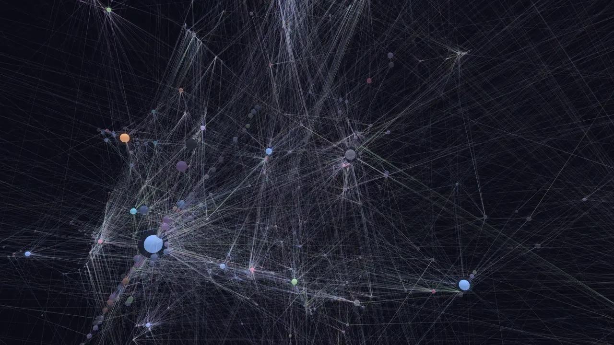
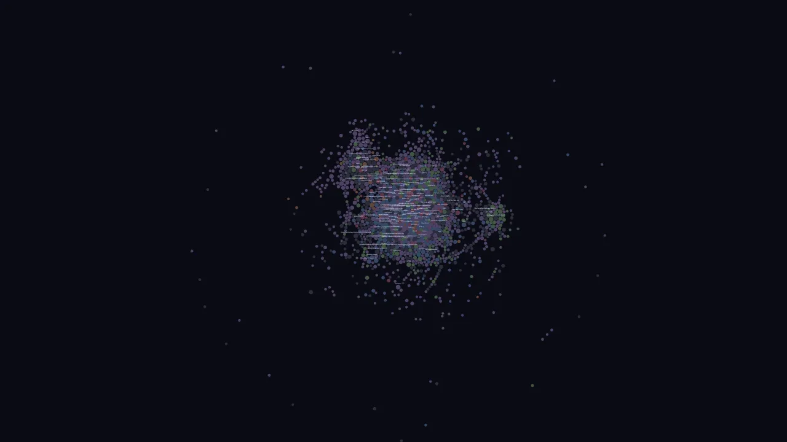
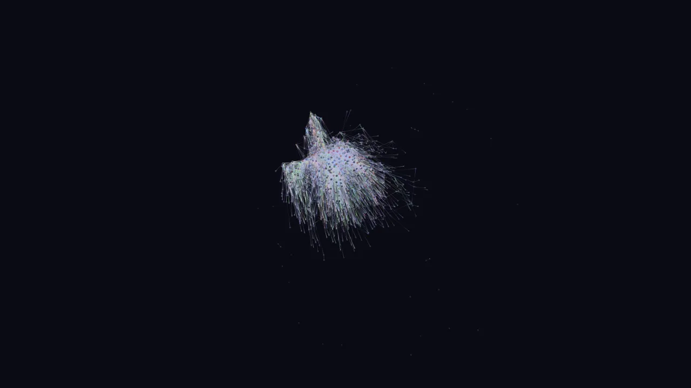
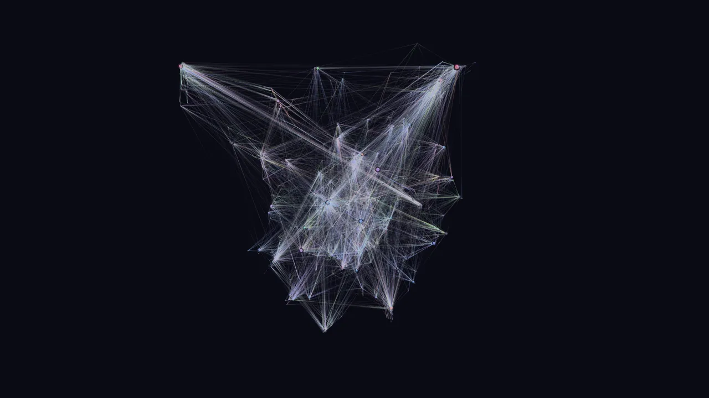
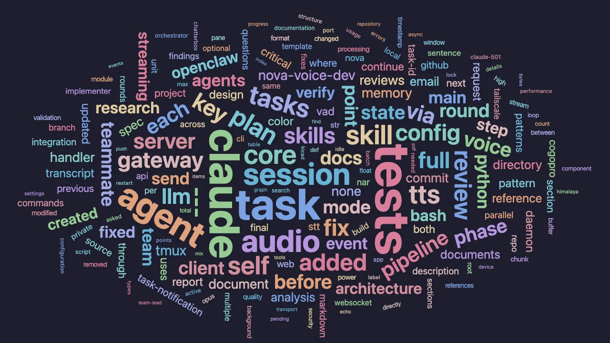
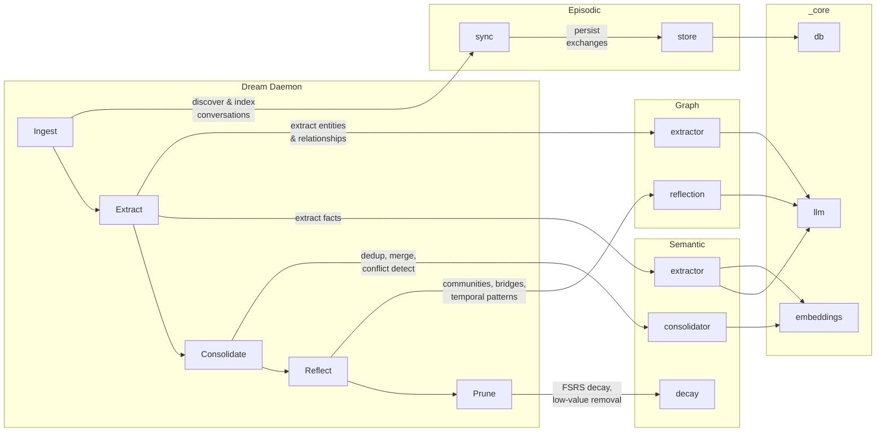

# Engram

> *An engram is the hypothetical physical trace of memory in neural tissue — the biochemical change that encodes what we've learned.*

<p align="center">
  
</p>

Local-first cognitive memory system that transforms raw LLM conversation history into structured, consolidated knowledge. Unlike traditional conversation search (which treats sessions as documents to retrieve), Engram mimics human memory architecture: **episodic memories are captured, consolidated into semantic knowledge during "dream state" processing, and emergent connections surface through graph analysis** — much like how a Zettelkasten's backlinks reveal Maps of Content that no individual note anticipated.

Designed as an MCP server for Claude Code and other LLM agents, with CLI and web visualization interfaces.

## Core Principles

### Memory is Not Search

Engram is a **cognitive system** — it extracts meaning, consolidates patterns, detects contradictions, and surfaces emergent connections. Raw conversations are the input, not the output.

### Token Discipline

Memory injection must be surgical. Retrieved memories are capped within caller-specified token budgets, formatted for primacy placement, and delivered via progressive disclosure — pointers first, full content only on request.

### Emergent Discovery

Like a Zettelkasten, the value is in the connections. Opportunistic bidirectional linking, Maps of Content emerging from graph density, and the dream state daemon acting as the librarian who notices patterns across the collection.

### Local-First, Offline-Capable

All processing runs locally. No cloud dependencies except optional API calls for extraction/summarization (replaceable with local models via Ollama for true offline operation).

## Architecture

Four domains with shared core infrastructure:

- `episodic/` — Conversation archive ingestion, indexing, and episodic search
- `semantic/` — Knowledge extraction, consolidation, adaptive chunking, and semantic search
- `graph/` — Entity/relationship graph, topic clusters, file structure indexing, and graph traversal
- `dream/` — Autonomous consolidation pipeline (ingest → extract → consolidate → reflect → prune)
- `interfaces/` — CLI, MCP server, and web visualization
- `_core/` — Shared infrastructure (config, db, types, embeddings, search, llm, cache)
- `decisions/` — Architecture Decision Records

## MCP Server

12 tools for LLM agent memory operations:

| Tool | Purpose |
|------|---------|
| `recall` | Hybrid search (vector + FTS5 + graph) with token budget |
| `remember` | Store a single memory (fact, decision, pattern, etc.) |
| `show` | Retrieve full conversation or memory context |
| `explore` | Fixed-depth graph traversal from an entity |
| `reflect` | Graph analysis — communities, bridges, temporal patterns |
| `recall_session` | Stateful iterative search with session tracking and budget |
| `recall_drill` | Deep drill into a specific search result with budget deduction |
| `explore_selective` | Model-directed selective graph traversal with relevance filtering |
| `remember_batch` | Batch memory ingest with entity linking and adaptive chunking |
| `fetch_snippets` | Multi-range file snippet fetching (up to 20 ranges) |
| `index_file_structure` | Parse file structure into graph entities (multi-language) |
| `scan_file` | Regex-based file scanning with function context detection |

## CLI

```
engram init            # Initialize database + download embedding model
engram sync            # Ingest conversations from Claude Code projects
engram search <query>  # Hybrid search across all memory layers
engram remember <text> # Store a memory
engram extract         # LLM-based fact extraction from a conversation
engram dream           # Run autonomous consolidation pipeline
engram reflect         # Show emergent graph patterns
engram explore <name>  # Explore entity connections
engram entities        # List/search entities
engram relationships   # Show relationships for an entity
engram stats           # Database statistics
engram health          # System health check
engram migrate         # Migrate data from legacy superpowers DB
engram validate        # Validate migration integrity
```

## Web Visualization

Interactive knowledge graph visualization at `localhost:3000`:

| | |
|---|---|
| **Force Graph** (`/graph`) | **Depth View** (`/graph/depth`) |
| Obsidian-inspired 2D force-directed graph on Canvas. Nodes sized by mention count (sqrt scale), colored by entity type with degree-based brightness. Edges render with configurable center-dim gradients. Mention threshold slider, type filter pills, text search with neighbor highlighting, click-to-focus, and node dragging. | Three.js 3D graph where the vertical axis encodes relevance — a weighted blend of recency (30%), mention frequency (25%), bridge score (20%), creation age (10%), and degree (15%). Older and less-connected nodes sink to the bottom; active hubs rise to the top. Includes gravity passes that pull satellites toward their hubs and a growth animation that replays the graph's history from first node to present. |
|  |  |
| **Galaxy View** (`/graph/galaxy`) | **Word Cloud** (`/words`) |
| Hub nodes (high degree + bridge score + mentions) become gravitational centers, each defining a unique orbital plane in 3D space. Satellites orbit their hub based on accretion strength (edge weight), placed at angles determined by Jaccard similarity to neighbors. Six custom forces — hub repulsion, satellite attraction, disk flattening, orbital alignment, bridge pulling, and standard charge — create a living solar-system metaphor. Configurable hub threshold, disk flatness, and system spacing. | D3 word cloud built from user messages in episodic memory. Words sized by sqrt-scaled frequency, filtered through an extensive stop-word list and hex-hash detector. Catppuccin Mocha 12-color palette, Archimedean spiral packing with mixed rotation (65% horizontal, 20% vertical, 15% angled). Hover shows mention count; live polling refreshes every 10 seconds with pulse animations on changes. |
|  |  |

- **Dream Control** — Live pipeline phase tracking with progress bars via SSE
- **Real-time Updates** — SSE watching SQLite WAL for instant graph changes

Start: `npx tsx src/interfaces/web/server.ts`

## Search

Hybrid search combining three sources with Reciprocal Rank Fusion:

- **Vector** — Semantic similarity via nomic-embed-text (384 dims) with MiniLM fallback
- **FTS5** — SQLite full-text search across exchanges, memories, and entities
- **Graph** — Entity traversal and relationship-aware context expansion

All search responses respect caller-specified token budgets. Stateful sessions allow iterative refinement with budget tracking.

## Dream Pipeline

Autonomous consolidation mimicking human memory synthesis:



1. **Ingest** — Sync new conversation archives via the **episodic** layer
2. **Extract** — LLM-based fact extraction (**semantic**) and entity/relationship extraction (**graph**)
3. **Consolidate** — Deduplicate, merge, and resolve conflicts via **semantic** consolidator with embedding similarity
4. **Reflect** — Detect communities, bridge entities, and temporal patterns via **graph** reflection
5. **Prune** — Decay and remove low-value memories using FSRS-inspired retrievability scoring (**semantic** decay)

All phases use **_core** infrastructure: `llm` for LLM calls, `db` for persistence, `embeddings` for similarity.

Run via `engram dream`, web UI dream button, or scheduled via launchd.

## Technology

| Component | Technology |
|-----------|------------|
| Runtime | Node.js ≥ 22 (TypeScript) |
| Database | SQLite + WAL mode (single-file, local-first) |
| Vector Search | sqlite-vec |
| Full-Text Search | SQLite FTS5 (Porter stemming) |
| Embeddings | nomic-embed-text via @xenova/transformers |
| Graph Analysis | graphology (Louvain communities, betweenness centrality) |
| LLM Providers | Anthropic, OpenRouter, Ollama (tiered cascade) |
| MCP Server | @modelcontextprotocol/sdk |
| Daemon | macOS launchd |

## Development

```bash
npm run build        # TypeScript compilation
npm run test:run     # Run tests (vitest, 56 test files)
npm run mcp          # Start MCP server
npm run dev          # Dev CLI via tsx
npm run dream        # Run dream consolidation
npm run lint         # Type-check without emit
```

## Configuration

| Variable | Default | Purpose |
|----------|---------|---------|
| `ENGRAM_DB_PATH` | `~/.local/share/engram/engram.db` | Database location |
| `ENGRAM_CHUNKING_STRATEGY` | `fixed` | `fixed` or `adaptive` (content-aware boundaries) |
| `ENGRAM_LLM_PROVIDER` | auto-detect | `anthropic`, `openrouter`, or `ollama` |
| `ENGRAM_LLM_MODEL` | provider default | LLM model for extraction operations |

## References

- [SPEC.md](./SPEC.md) — Full system specification with requirements and interface contract
- [SPEC-legacy.md](./SPEC-legacy.md) — Original vision document with detailed design rationale
- [plans/](./plans/) — Implementation plans (phases 1–4, phase 6 RLM, phase 7 extensions)
- [decisions/](./decisions/) — Architecture Decision Records
